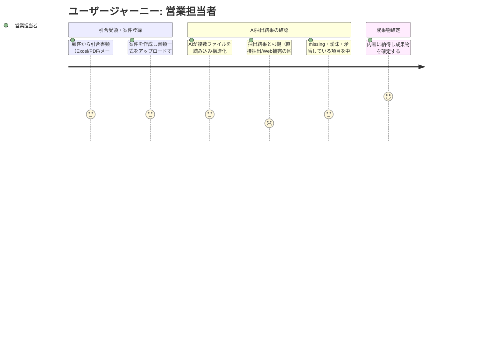

# 要求定義書: 引合書整理エージェント

> Vモデル: 要求分析 / 対応する検証: 受入テスト
> このプロジェクトで「誰の・どんな課題を・なぜ解決するか」を定義する。

> 出典の凡例:
> 【確定】Bootcamp課題資料で明示されている確定要求
> 【提案】提案資料（reference-local/proposal.pptx）から確認できる業務背景・設計意図（Sprint3の必須要件ではない）
> 【観察】sample-data から観察できる特徴
> 【仮説】要確認事項として扱う推測（要求として未確定）

## 1. 背景・課題

### 背景

T社鉄鋼関連部門における引合整理の手作業という課題に対し、AIエージェントによって資料読込→情報抽出・構造化→成果物生成→担当者確認までを支援するシステムを設計する。【確定】

なお、reference-local/proposal.pptx は、より広い「引合・発注業務全体のAIエージェント化」構想を含む提案資料だが、これは要求・スコープの正本ではなく、業務背景・設計思想を理解するための参考資料としてのみ扱う。本Sprint3の要求はBootcamp課題資料で設定された「引合書整理」という業務課題に基づく。【提案（参考情報であり要求ではない）】

### 現状

顧客から届く注文・引合書類は、オーダーリストExcel、テンダー資料PDF、引合メールなど複数形式で受領しており、構造化されておらず、案件ごとにフォーマットも異なる。【確定】
現在は担当者が資料を目視で読み込み、必要情報を探して抽出・転記し、構造化された品目リスト（Item List）を手作業で作成している。フォーマットが案件ごとに異なるため単純なルールベースの自動化では対応しづらい。【確定】

sample-data を確認したところ、この多様性は実際に以下のように現れている。【観察】
- xlsxのオーダーリストは、見出しが複数行にわたり、サイズが「外径×単重」のように複数セルに分かれるなど、表構造が案件ごとに異なる。
- eml（引合メール）は自然文で明細が箇条書きされており、本文の途中や末尾の追記（P.S.等）で数量等の内容が後から更新されているケースがある（例：明細1行目の数量が本文末尾で240本→320本に上書きされる）。単純な先頭一致の抽出では誤りうる。
- PDF（見積依頼書・調達仕様書・入札明細書・RFQ等）は、確認した4件でページ数が2〜7ページと異なり、文書の型（見積依頼の挨拶文＋明細／仕様書／入札条件と脚注付き明細／英文RFQ＋Schedule形式）も案件ごとに異なる。日本語のみの文書と英語のみの文書が混在する。

### 課題一覧

| # | 課題 | 影響度 | 優先度 |
|---|------|--------|--------|
| 1 | 案件ごとに書類フォーマットが異なり、単純なルールベースでの自動化が難しい（構造的原因） | 高 | 高 |
| 2 | 担当者が資料を目視で読み込み、必要情報を抽出・転記する作業に時間を取られている（最優先で解決したい業務課題） | 高 | 高（最優先） |
| 3 | その結果、交渉・判断など本来注力すべき業務に十分な時間を割けていない（事業上の影響） | 高 | 高 |

上記3つは独立した課題ではなく、#1（構造的原因）→ #2（業務課題）→ #3（事業影響）という因果関係にある。本Sprint3では、#2の手作業（読込→構造化→成果物生成）をAIエージェントで一気通貫に実行することを最優先の解決対象とする。

## 2. ゴール

### ビジネスゴール

営業担当者が転記作業から解放され、交渉・判断など高付加価値業務に時間を使えるようにすることで、鋼管部門の引合対応の生産性を高める。合わせて、対応リードタイムの短縮、転記ミス・対応漏れの削減、業務の属人化の軽減を目指す。

### ユーザーゴール

担当者の役割を「資料をゼロから読み解いて転記する」状態から、「AIの出力と抽出根拠を確認・修正する」状態へ変える。案件作成〜書類アップロードのみで、必要項目が整理された構造化JSONとItem List（Excel）が得られ、担当者はmissing・曖昧・矛盾している項目を中心に確認するだけで成果物を確定できる。

### 成功指標（KPI）

Bootcamp課題資料に定量目標の明記はないため、以下はPoCで検証する暫定KPIとして設定する。【仮説（PoC検証用の暫定目標）】

| 指標 | 目標値 | 測定方法 |
|------|--------|---------|
| 一次成果物作成時間（主要KPI） | 現行の手作業比で50%以上削減 | 同一サンプル案件について、「人手でItem Listを作成する時間」と「AIに投入し確認・修正してItem Listを確定するまでの時間」を比較する |
| フィールド抽出精度（品質KPI） | 資料に明記されている必要項目のフィールド単位正答率90%以上 | サンプル案件の正解データと抽出結果を項目単位で比較。特に数量・外径・肉厚・長さ・グレード等の重要項目の誤抽出を重点確認する |
| 根拠確認可能率（信頼性KPI） | 100% | AIが抽出・補完した全項目について、担当者がその根拠（資料の該当箇所、またはWeb検索補完である旨）を確認できる状態になっているかを確認する |

## 3. ペルソナ

### 営業担当者（Primary Persona）

| 項目 | 内容 |
|------|------|
| 名前 | （個人名は設定せず「営業担当者」として扱う） |
| 年齢 | 30歳前後【仮説】 |
| 職業 | 営業担当者レベル【仮説】 |
| 部門 | T社鉄鋼関連部門（鋼管を扱う営業部門） |
| 技術スキル | Excel・メール・PDF等のOffice系ツールを日常的に使用できる一般的な業務ユーザー。AI・プログラミングの専門知識は前提としない |

**目標・ゴール**

- 顧客から届く引合資料を読み解き、案件内容・要求仕様を短時間で正確に把握したい
- 見積作成や社内外（仕入先・技術部門等）との調整に時間を使いたい。転記作業ではなく交渉・判断に注力したい

**課題（ペインポイント）**

- 案件ごとに資料フォーマットが異なり、都度ゼロから読み解く必要があり時間がかかる
- 目視での抽出・転記のため、ミスや対応漏れのリスクがある

**利用状況**

| 利用場面 | 頻度 | 詳細 |
|---------|------|------|
| 顧客から引合書類（Excel/PDF/メール）を受領したとき | 未確定【要確認】 | T社における1日・1週間あたりの引合件数は資料から確認できないため、ユーザーインタビュー等で確認すべき事項として残す |
| 受領書類からItem Listを作成するとき | 引合受領ごと | 複数ファイルを読み込み、必要項目を抽出・整理し、社内で使う構造化された品目リストを作成する |

> Secondary Persona（将来拡張候補・仮説）: 会社によっては営業事務・営業支援担当者が見積作成・注文対応・素材発注・納期調整等を担うケースがあるため、将来的なSecondary Personaとして想定する。T社における実際の役割分担は未確認のため、本Sprint3ではPrimary Persona（営業担当者）の業務を中心に設計する。

## 4. ユーザージャーニー

### メインフロー

| # | フェーズ | 行動 | 課題・感情 | 解決 |
|---|---------|------|----------|------|
| 1 | 引合受領・案件登録 | 顧客からExcel・PDF・メール等で引合書類を受け取り、案件を作成して一式をアップロードする | 「案件ごとに形式が違い、また最初から資料を読み込まないといけないのか」という気重さ | 複数形式のファイルをそのまま一括投入できるようにする |
| 2 | AI抽出結果の確認 | AIが生成した構造化JSON・Item Listと抽出根拠を確認し、必要に応じて修正する | AIの出力だけでは、直接資料から抽出された情報かWeb検索で補完された情報か、どの資料のどこから取られたのかが分からないと、結局元資料を最初から見返す必要が生じ、作業負荷が下がらない | missing・曖昧・矛盾している項目を明確に示し、各項目の抽出根拠（直接抽出／Web補完の区別を含む）を即座に確認できるようにする |
| 3 | 成果物確定 | 確認・修正済みのItem Listを成果物として確定する | 内容に納得して確定できるかという不安 | Human-in-the-Loopの確認を経て確定するフローとし、安心して確定できる状態にする |

### 感情の変化

- **開始時**: 「案件ごとに形式が違い、また最初から資料を読み込まないといけないのか」という気重さ
- **最初のつまずき**: AIが値を出しても、根拠（どの資料のどこから、直接抽出かWeb補完か）が分からなければ、結局元資料を最初から見返すことになり、作業負荷が十分に下がらないという不安
- **ブレークスルー**: missing・曖昧・矛盾している項目とその根拠が明示され、「怪しいところだけ確認すればよい」と分かった瞬間
- **ゴール達成時**: 「全部読まないと分からない」状態から「AIが整理した全体像が一目で分かり、安心して確定できる」状態への転換

## 5. 利害関係者

| 利害関係者 | 期待 |
|-----------|------|
| 営業マネージャー／上司 | 引合対応のリードタイム短縮、転記ミス・対応漏れの削減、営業担当者の生産性向上、業務の属人化の軽減 |
| 調達・購買・仕入担当者 | 営業担当者が顧客から受け取った引合情報について、仕様・数量・納期等が整理された状態で受け取り、仕入先・メーカーへの確認や調達判断を行いやすくなること |
| 営業事務・営業支援担当者（Secondary Persona） | 見積・受発注・後続データ入力等に利用できる、標準化され正確な情報を受け取れること（T社でどこまで担当するかは未確認【仮説】） |
| 技術・商品担当者 | 鋼管の規格・仕様等について専門的な確認が必要な場合に、顧客要求が整理された状態で確認できること（T社の実際の業務分担は未確認【仮説】） |
| IT／DX部門 | 顧客資料をAIで処理するにあたっての情報セキュリティ、データ管理、AI出力の信頼性・監査可能性の担保、将来的な既存システム連携を可能にする設計であること |

> 顧客側担当者・仕入先/メーカー等も間接的な利害関係者として想定される（顧客にとっては見積回答の迅速化・正確性向上、仕入先にとっては仕様確認の往復削減等が期待される）が、これらは間接的な関係者であり、本Sprint3では営業担当者（Primary Persona）の引合整理業務を中心に設計し、他部門・社外関係者まで業務スコープを広げない。【仮説を含む】

---

## 次のステップ

→ `/design-problem-check` で問題定義フェーズのレビューを行う
→ `/design-requirement`（要件定義書）で機能一覧・要件・スコープ・非機能要件を定義する
