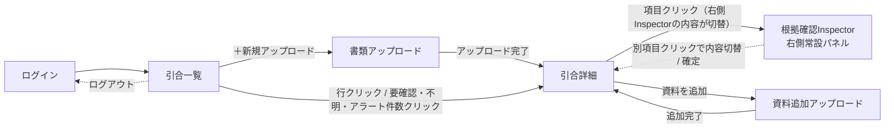

# 仕様書（基本設計）: 引合書整理エージェント

> Vモデル: 基本設計 / 対応する検証: 結合テスト
> 要件（02-requirement.md）を画面に落とし込む。画面構成・画面ごとの機能・モックHTMLを定義する。
> モックは全画面を1つにまとめた [mocks/mockup.html](./mocks/mockup.html) に作成する（画面ID `#SCR-xx` で各画面へアンカー移動）。
>
> **画面レイアウト方針**: 全画面（ログイン画面を除く）で「左サイドバー + 上部ヘッダー（パンくず）+ メインコンテンツ」の3分割レイアウトに統一する。常に「現在地」「次に取るべき操作」が分かる状態を保つ。
> **補助導線**: ヘルプはサイドバーには置かず、全画面共通で右下に固定表示する「？」アイコン（ヘルプFAB）として提供する。将来的にはクリック時にドロワー等で操作方法・FAQ・この画面について・問い合わせを表示する想定だが、本MVPではアイコン表示のみとする。
>
> **デザイン方針（配色・トーン）**: 黒・グレーを基調とした無彩色ベースに、濃淡のグラデーションで階調をつけ、業務ツールとしての信頼感・落ち着きを重視する。派手な装飾は避け、文字量よりもレイアウト・アイコン・余白・視線誘導で理解できるUIを目指す。ただし状態表示（要確認／不明／アラート／Web補完）は識別性を優先し、無彩色の中で必要最低限のアクセントカラー（琥珀＝要確認、スレートグレー＝不明、レッド＝アラート、ティール＝Web補完、グリーン＝確定済み）を用いる。詳細は「8. ステータス表現」を参照。
>
> **サイドバー方針**: 黒〜チャコールグレーの控えめなグラデーション背景に、アイコン＋ラベルのナビゲーションを配置するモダンなSaaS型サイドバーとする。項目は上から「引合一覧／＋新規アップロード／確認中（件数バッジ）／確定済み（件数バッジ）」、区切り線を挟んで「見積書発行（今後対応・プレースホルダー、クリック不可）／設定（今後対応・プレースホルダー）」の順に並べ、選択中の項目は左端のアクセントバーと明るい背景で示す。下部にはユーザー情報とログアウトボタンを固定表示する。デスクトップでの長時間業務利用を前提に、十分なコントラストと余白を確保する。
>
> **右側Inspector／Split View方針**: 根拠確認・値確定（旧SCR-04）は、画面を覆うオーバーレイ型ドロワーではなく、SCR-03の右側に常設される比較パネル（Inspector）として表示する。背景を暗転させず、左側の案件情報は常に閲覧・操作可能なまま、右側で「候補比較 → 根拠確認 → 確定」を連続して行える。左側の別の要確認／不明／アラート項目をクリックすると、右側の内容がその場で切り替わる（画面遷移・モーダル開閉なし）。パネル幅は左右境界のドラッグでユーザーが変更できる。モーダルは削除確認・確定確認・ログアウト確認などの限定用途にのみ使用する。

## 1. 画面構成（サイトマップ）

| 画面ID | 画面名 | 目的 | 対応機能(②) | モック |
|--------|-------|------|-------------|-------|
| SCR-00 | ログイン | メールアドレス／パスワードでログインする（ローカルPoCの単一ユーザーログイン） | 非機能要件（4章、認証はMVPでは簡易実装） | [mockup.html#login-screen](./mocks/mockup.html#login-screen) |
| SCR-01 | 引合一覧 | 全引合を状態（確認中／確定済み）別に一覧表示し、新規アップロードの起点となる | FUNC-01（起点）、FUNC-07（状態集計表示） | [mockup.html#SCR-01](./mocks/mockup.html#SCR-01) |
| SCR-02 | 書類アップロード | Excel／PDF／メールを一括アップロードし、新しい引合を自動生成する | FUNC-01 | [mockup.html#SCR-02](./mocks/mockup.html#SCR-02) |
| SCR-03 | 引合詳細（サマリー・確認 / Split View） | 左側に案件サマリー→品目一覧→その他特記事項、右側に根拠確認Inspectorを常設したSplit View。確認・修正・確定・出力を連続して行うハブ画面 | FUNC-02, FUNC-03, FUNC-05, FUNC-06, FUNC-07, FUNC-08, FUNC-09 | [mockup.html#SCR-03](./mocks/mockup.html#SCR-03) |
| SCR-04 | 根拠確認Inspector（右側常設パネル） | 選択した項目の抽出根拠を、資料形式に応じたプレビュー（PDFページ・メール本文・Excelセル・Web参照）とともに確認し、値を修正・確定できる。SCR-03の右側領域に常設表示（オーバーレイではない） | FUNC-06, FUNC-08 | [mockup.html#inspector](./mocks/mockup.html#SCR-03) |
| SCR-05 | 資料追加アップロード | 既存の引合に追加資料をアップロードする | FUNC-01（追加） | [mockup.html#SCR-05](./mocks/mockup.html#SCR-05) |

### 画面遷移図

## 2. 画面ごとの仕様

### SCR-00 ログイン

**目的**: 営業担当者がメールアドレス・パスワードでログインする。ローカル・単一ユーザーのPoCを前提とした簡易ログインであり、サイドバー等のアプリシェルは持たない単独画面とする。

**UI要素**

| 要素 | 説明 | 位置 | 対応機能(②) |
|------|------|------|-------------|
| ロゴマーク／プロダクト名 | 黒基調のロゴマーク＋「引合書整理エージェント」 | カード上部中央 | - |
| メールアドレス入力 | テキスト入力欄 | カード中央 | 非機能要件（4章） |
| パスワード入力 | パスワード入力欄（マスク表示） | カード中央 | 非機能要件（4章） |
| ログインボタン | 主要アクション（primaryボタン1つのみ） | カード下部 | 非機能要件（4章） |

**操作とインタラクション**

| 操作 | UI要素 | 挙動 | 対応機能(②) |
|------|--------|------|-------------|
| ログインボタンクリック | ログインボタン | 入力値を検証しSCR-01（引合一覧）へ遷移する | 非機能要件（4章） |
| サイドバーのログアウトボタンクリック（SCR-01〜05側） | ログアウトボタン | 「ログアウトしますか？」の確認モーダル（限定用途モーダル）を表示し、「ログアウト」選択でSCR-00に戻る | 非機能要件（4章） |

**エラー・例外表示**

| ケース | トリガー | 画面の挙動・表示 | 対応する要件(②) |
|--------|---------|----------------|----------------|
| メールアドレス／パスワード未入力 | ログインボタン押下時に空欄がある | 該当入力欄の枠を強調し、「メールアドレスとパスワードを入力してください」を表示 | 非機能要件（4章） |
| 認証失敗 | 誤ったメールアドレス／パスワードでログイン | カード内に「メールアドレスまたはパスワードが正しくありません」を表示し、入力欄はクリアしない | 非機能要件（4章） |

**モック**: [mockup.html#login-screen](./mocks/mockup.html#login-screen)

---

### SCR-01 引合一覧

**目的**: 全引合を一覧表示し、状態（確認中／確定済み）・要確認／不明件数を一目で把握できるようにする。新規アップロードの起点であり、ログイン後の既定表示画面。

**UI要素**

| 要素 | 説明 | 位置 | 対応機能(②) |
|------|------|------|-------------|
| サイドバー | 黒〜チャコールグラデーションの常設サイドバー。上から「引合一覧／＋新規アップロード／確認中（件数バッジ）／確定済み（件数バッジ）」、区切り線の下に「見積書発行」「設定」（いずれも「今後対応」タグ付きでクリック不可のプレースホルダー）。下部にユーザー情報・ログアウトを固定表示 | 画面左（全画面共通） | FUNC-01, FUNC-07（見積書発行・設定はOut of Scope、将来構想の提示のみ） |
| ヘルプFAB | 右下固定の「？」円形ボタン（補助導線）。将来的にクリックで操作方法／FAQ／この画面について／問い合わせをドロワー等で表示予定。MVPではアイコン表示のみ | 画面右下（全画面共通、ログイン画面含む） | - |
| パンくず | 「引合一覧」を表示 | ヘッダー | - |
| フィルタタブ | すべて／確認中／確定済み（件数付き） | 一覧上部 | FUNC-07 |
| 引合テーブル | 依頼元企業・案件名・依頼日時・状態バッジ・要確認件数・不明件数・アラート件数・最終更新日時の列。行全体がクリック可能で、ホバー時に背景色が変わり、行末に「›」を表示してクリック可能性を示す | 画面中央 | FUNC-05, FUNC-07 |
| 要確認／不明／アラートの件数バッジ | それぞれアクセントカラー（琥珀／スレートグレー／レッド）を付けたクリック可能なバッジとして表示し、一覧上で状態の分布が一目で分かるようにする。0件はグレーの控えめな表示にする | テーブル内 | FUNC-07 |
| 空状態 | 大きめのアイコン（書類＋虫眼鏡）＋短い見出し＋CTAボタンのみで構成し、説明文は持たせない。レイアウトとアイコンで意味を伝える | 一覧が0件の場合、テーブルの代わりに表示 | FUNC-01 |

**操作とインタラクション**

| 操作 | UI要素 | 挙動 | 対応機能(②) |
|------|--------|------|-------------|
| 「＋新規アップロード」クリック（サイドバー／ヘッダー） | サイドバー項目 or ページ内ボタン | SCR-02へ遷移 | FUNC-01 |
| 行クリック（行内のリンク以外の領域） | テーブル行 | SCR-03（当該引合の詳細）へ遷移 | FUNC-05 |
| 要確認／不明／アラートの件数バッジクリック | 件数バッジ | SCR-03へ遷移し、該当する種別の項目に自動スクロール・絞り込みした状態で表示 | FUNC-07 |
| フィルタタブ／サイドバーの確認中・確定済みクリック | フィルタタブ、サイドバー項目 | 一覧を状態で絞り込み表示 | FUNC-07 |
| 空状態のCTAクリック | CTAボタン | SCR-02へ遷移 | FUNC-01 |

**エラー・例外表示**

| ケース | トリガー | 画面の挙動・表示 | 対応する要件(②) |
|--------|---------|----------------|----------------|
| 引合が0件 | 初回利用時・全件削除後等 | イラスト付き空状態＋CTAボタンを表示し、次に取るべき操作（アップロード）を明確に示す | FUNC-01 |

**モック**: [mockup.html#SCR-01](./mocks/mockup.html#SCR-01)

---

### SCR-02 書類アップロード

**目的**: Excel／PDF／メールをドラッグ&ドロップまたは選択でアップロードし、事前の案件作成なしに新しい引合を自動生成する。

**UI要素**

| 要素 | 説明 | 位置 | 対応機能(②) |
|------|------|------|-------------|
| 対応形式チップ | 「Excel（.xlsx）」「PDF（.pdf）」「メール（.eml）」のコンパクトな3チップ | ドロップ領域の上 | FUNC-01 |
| ドロップ領域（主役） | 画面内で最も大きい破線枠のカード。アップロードアイコン＋「ここにドラッグ＆ドロップ」の大見出し＋補助的な「ファイルを選択」ボタン。「ファイルを選択」はあくまで代替手段としてD&Dより小さく配置する。ドラッグ中は枠を実線化し背景を強調（dragover状態） | 画面中央、大きく確保 | FUNC-01 |
| 選択済みファイルリスト | ファイル形式アイコン＋ファイル名＋削除ボタン | ドロップ領域の下 | FUNC-01 |
| インラインエラー | 非対応形式ファイルの拒否メッセージ（⚠️アイコン＋アラート配色） | ファイルリストの上 | FUNC-01 |
| 「アップロード開始」ボタン＋進捗・状態インジケーター | ボタンの右隣にスピナー＋進捗バー＋短い状態テキスト（「AIが解析中…」）、さらに「アップロード → 解析中 → 完了」のステップ表示で進行度を可視化する。文言は短く保つ | 画面下部 | FUNC-01, FUNC-02〜05（解析処理） |

**操作とインタラクション**

| 操作 | UI要素 | 挙動 | 対応機能(②) |
|------|--------|------|-------------|
| ファイルのドラッグ&ドロップ／「ファイルを選択」 | ドロップ領域 | ファイルをリストに追加。ドラッグ中は領域の見た目を変化させ、ドロップ可能であることを示す | FUNC-01 |
| ファイルリストの「削除」クリック | 削除ボタン | 該当ファイルをリストから除去 | FUNC-01 |
| 「アップロード開始」クリック | ボタン | アップロードを実行し、進捗バー・解析中メッセージを表示。完了後、新規に生成された引合のSCR-03へ自動遷移 | FUNC-01〜05 |

**エラー・例外表示**

| ケース | トリガー | 画面の挙動・表示 | 対応する要件(②) |
|--------|---------|----------------|----------------|
| 非対応形式ファイルのドロップ／選択 | xlsx/pdf/eml以外のファイル | 該当ファイルをリストに追加せず、ドロップ領域直下に「対応していない形式です（Excel／PDF／メールのみ）」を表示 | FUNC-01 |
| ファイル未選択で「アップロード開始」 | ファイルリストが空 | ボタンを非活性表示にし、押せないことを明示 | FUNC-01 |

**モック**: [mockup.html#SCR-02](./mocks/mockup.html#SCR-02)

---

### SCR-03 引合詳細（サマリー・確認）

**目的**: 左側に「案件サマリー→品目一覧→その他特記事項」の3段構成、右側に根拠確認Inspectorを常設したSplit Viewで引合内容を一覧性高く表示し、担当者が不明・要確認・アラート箇所だけを左を見ながら右で連続して確認・修正・確定できるようにする（本システムの中核画面）。

**UI要素**

| 要素 | 説明 | 位置 | 対応機能(②) |
|------|------|------|-------------|
| ページヘッダー | 依頼元企業名・案件名・引合ID・依頼日時・状態バッジ | 画面上部 | FUNC-05 |
| 状態凡例（レジェンド） | 「確認不要／不明／要確認／アラート／Web補完」の5状態をドット＋アクセントカラーで統一表示。色の定義は「8. ステータス表現」を参照 | 案件サマリーの直上 | FUNC-07 |
| 案件サマリー（表形式） | A項目（依頼元企業〜市況、その他特記事項を除く）をラベル列＋値列の情報リスト形式で表示し、比較しやすくする。行にホバーで背景色が変化し、選択中の行は背景を保持して現在Inspectorに表示中の項目が分かるようにする | 左側・上段 | FUNC-02, FUNC-06, FUNC-07 |
| 品目一覧テーブル | B項目（製管方法〜数量）を品目行×列の表形式で表示。要確認／アラートのセルはバッジ＋アクセントカラーで強調 | 左側・中段 | FUNC-02, FUNC-06, FUNC-07 |
| その他特記事項（タブ切替） | 「案件全体」／「品目固有」のタブで表示を切替。各特記事項は出典を右側に小さく表示 | 左側・下段 | FUNC-02 |
| 再編集時の注意バナー | 確定済み状態で値を修正した場合に表示 | 特記事項の下 | FUNC-09 |
| アクションバー | 「📎資料を追加」／出力形式セレクタ＋「⬇ダウンロード」／「✔確定する」。出力形式セレクタはExcel（活性）・Word／PDF（今後対応・非活性）のセグメントボタンとし、将来の出力形式拡張の余地をUI上に示す（本モックではExcelのみ機能） | 左側・画面下部 | FUNC-01, FUNC-05, FUNC-09 |
| 根拠確認Inspector（右側常設パネル） | 「1. 全体方針」および「3. 右側Inspector」節のとおり、常設の比較パネルとして表示。詳細はSCR-04を参照 | 画面右側（左右分割ハンドルで幅変更可） | FUNC-06, FUNC-08 |

**操作とインタラクション**

| 操作 | UI要素 | 挙動 | 対応機能(②) |
|------|--------|------|-------------|
| 案件サマリーの行クリック／品目一覧の値セルクリック | テーブル行・セル | 右側Inspectorの内容を、クリックした項目の根拠確認表示に切り替える（画面遷移・モーダル表示なし）。既にInspectorが別項目を表示中でも即座に切り替わる | FUNC-06, FUNC-08 |
| 左右パネルの境界をドラッグ | Split View境界（ハンドル） | Inspectorパネルの幅を変更する | - |
| その他特記事項のタブクリック | 「案件全体」／「品目固有」タブ | 表示するリストを切替 | FUNC-02 |
| 「資料を追加」クリック | アクションバーのボタン | SCR-05へ遷移 | FUNC-01 |
| 出力形式セレクタでExcelを選択→「ダウンロード」クリック | アクションバーのボタン | 現在の構造化JSONの状態（確認中／確定済み）に応じ、`_draft`／`_final`のファイル名でExcelを生成・ダウンロード。Word／PDFは今後対応のため選択不可 | FUNC-05 |
| 「確定する」クリック | アクションバーのボタン（確認中状態のときのみ活性） | 確定確認モーダル表示後、状態が「確定済み」に変わり、バッジ表示が更新される | FUNC-09 |

**エラー・例外表示**

| ケース | トリガー | 画面の挙動・表示 | 対応する要件(②) |
|--------|---------|----------------|----------------|
| 項目が「不明」 | 資料から抽出できず値が存在しない | セルに「不明」バッジ（スレートグレー）を表示 | FUNC-07 |
| 項目が「要確認」 | 複数候補が存在する、またはAIの抽出確度が低く人の確認が必要 | セルに「要確認」バッジ（琥珀）と候補件数を表示。クリックで右側Inspectorに理由・候補値・出典を表示 | FUNC-07 |
| 項目が「アラート」 | 資料間で値が矛盾している、または内容が曖昧で機械的に判断できない | セルに「アラート」バッジ（レッド）を表示し、要確認より優先度が高いことを示す。クリックで右側Inspectorに矛盾内容・候補値・出典を表示 | FUNC-07 |
| Web補完された項目 | FUNC-04によりWeb検索で補完 | 値に点線の下線＋「Web補完」バッジ（ティール）を付与し、直接抽出値と区別する | FUNC-04, FUNC-06 |
| 確定済み状態での再編集 | 確定済みの項目を右側Inspector経由で修正 | 特記事項の下に「確定済みの内容を変更しました。再度出力してください」の注意バナーを表示（編集自体は禁止しない） | FUNC-09 |
| 不明項目のある品目での出力 | 品目に不明が残っている状態でダウンロード | 出力はブロックせず、該当セルは「不明」の表示のまま出力する | FUNC-05 |

**モック**: [mockup.html#SCR-03](./mocks/mockup.html#SCR-03)

---

### SCR-04 根拠確認Inspector（右側常設パネル / Split View）

**目的**: 選択した項目について、担当者が元資料を開き直さずに「なぜこの値になったのか」を画面内で確認し、必要なら値を修正・確定できるようにする。背景を暗転させるオーバーレイ型ドロワーではなく、SCR-03の右側に常設される比較パネル（Inspector）として実装し、複数項目を連続して確認・確定する業務に最適化する。左側で別の項目をクリックすると、モーダルの開閉を挟まずパネルの内容だけが切り替わる。

**UI要素**

| 要素 | 説明 | 位置 | 対応機能(②) |
|------|------|------|-------------|
| 未選択時プレースホルダー | 「項目を選択してください」というアイコン中心の案内表示。左側で何も選択していない初期状態に表示し、パネル自体は常に画面に存在する | パネル全体 | - |
| Inspectorヘッダー | 項目名・状態バッジ（要確認／不明／アラート／Web補完／確認不要）・状態の理由（複数候補／矛盾・曖昧のいずれか、「8. ステータス表現」の定義に基づく） | パネル上部 | FUNC-06, FUNC-07 |
| 候補値リスト | 候補値＋出典（資料種別アイコン＋ファイル名／該当箇所）をカードで並べ、クリックで選択状態（枠強調）に切替。候補が1件の場合はその根拠を、0件（不明）の場合はプレースホルダーを表示する | ヘッダー直下 | FUNC-06, FUNC-08 |
| 出典プレビュー | 選択中の候補について、資料形式に応じたプレビューを表示。PDF: ページ番号＋該当テキストのハイライト＋ページ送り、EML: 件名＋本文該当箇所の抜粋、Excel: シート名・セル位置＋対象セル周辺の簡易グリッド、Web: 参照元情報＋抜粋。共通のプレビューUI構造をPDF/Excel/EML/Webで統一し、将来の拡張に備える | 候補値リストの下 | FUNC-06 |
| 確定する値の入力欄 | テキスト入力（候補選択で自動入力、手動編集も可） | パネル下部 | FUNC-08 |
| フッターボタン | 「閉じる」（Inspectorを未選択状態に戻す）「この値を確定する」 | パネル最下部 | FUNC-08 |

**操作とインタラクション**

| 操作 | UI要素 | 挙動 | 対応機能(②) |
|------|--------|------|-------------|
| 候補値カードクリック | 候補カード | カードを選択状態にし、出典プレビューと確定する値の入力欄に反映する（連続比較のため画面遷移なし） | FUNC-08 |
| PDFプレビューのページ送り | ページ送りボタン（‹ ›） | プレビュー内のページを前後に切替 | FUNC-06 |
| 「この値を確定する」クリック | フッターボタン | 入力値を構造化JSONに反映し、左側の該当セルの表示を更新（状態が「確認不要」に変わる）。パネルは開いたまま次の項目を続けて選べる | FUNC-08 |
| 左側で別の項目をクリック | 案件サマリー行／品目一覧セル | Inspectorの内容が新しい項目にその場で切り替わる（連続確認） | FUNC-06, FUNC-08 |
| 「閉じる」クリック | フッターボタン | 変更を反映せずInspectorを未選択状態（プレースホルダー）に戻す | FUNC-08 |

**エラー・例外表示**

| ケース | トリガー | 画面の挙動・表示 | 対応する要件(②) |
|--------|---------|----------------|----------------|
| 修正入力欄を空のまま確定 | 入力値なしで「この値を確定する」 | 値を空で確定した場合は状態が「不明」に戻ることを示す確認メッセージを表示 | FUNC-08 |
| 候補が0件（不明） | 資料に記載が見つからない | 候補値リストの位置に「候補となる記載が見つかりませんでした」を表示し、入力欄から直接値を確定できるようにする | FUNC-06 |
| プレビューが表示できない資料形式（将来拡張分） | 未対応の出典形式 | 「このファイル形式のプレビューは未対応です」を表示し、ファイル名・該当箇所のテキスト情報のみ表示する（MVPではPDF/Excel/EML/Webを対象とし、この分岐は将来拡張の受け皿） | FUNC-06 |

**モック**: [mockup.html#SCR-03](./mocks/mockup.html#SCR-03) の `#inspector`（SCR-03内から `openInspector()` で表示切替）

---

### SCR-05 資料追加アップロード

**目的**: 既存の引合に対し、担当者が明示的な操作で追加資料をアップロードする（AIによる自動紐付けは行わない）。

**UI要素**

| 要素 | 説明 | 位置 | 対応機能(②) |
|------|------|------|-------------|
| 対象引合の表示 | 依頼元企業・案件名・引合IDの確認表示 | 画面上部 | FUNC-01 |
| 対応形式チップ／ドロップ領域／ファイルリスト | SCR-02と同一構成 | 画面中央 | FUNC-01 |
| 「追加する」ボタン | 主要アクション | 画面下部 | FUNC-01 |

**操作とインタラクション**

| 操作 | UI要素 | 挙動 | 対応機能(②) |
|------|--------|------|-------------|
| ファイル追加→「追加する」クリック | ボタン | 追加資料を対象引合に紐づけ、AI処理を再実行してSCR-03に戻る | FUNC-01, FUNC-02〜05 |

**エラー・例外表示**

| ケース | トリガー | 画面の挙動・表示 | 対応する要件(②) |
|--------|---------|----------------|----------------|
| 非対応形式ファイルのドロップ／選択 | xlsx/pdf/eml以外のファイル | SCR-02と同様のインラインエラーを表示 | FUNC-01 |

**モック**: [mockup.html#SCR-05](./mocks/mockup.html#SCR-05)

---

## 3. デザイントークン

> ⚠️ ここで決めたデザインが Build 以降のUIの基準として固定される。`mocks/mockup.html` には下記トークンを実装済みだが、**最終的な配色・フォント選定は次のステップ「デザイン適用」でのレビューを経て確定する**。

| トークン | 値（例） | 用途 |
|---------|---------|------|
| `--bg` | `#f4f5f6` | ページ背景（無彩色ベース） |
| `--surface` / `--surface-2` | `#ffffff` / `#eef0f1` | カード・テーブル背景、hover背景 |
| `--text` / `--text-secondary` / `--text-meta` | `#1b1d1f` / `#5c6368` / `#8b9198` | 本文／補足／メタ情報の階調 |
| サイドバー背景 | `linear-gradient(165deg, #1c1e21, #131417, #0b0c0d)` | 黒〜チャコールグレーの控えめなグラデーション |
| `--c-review`（要確認） | 文字 `#a9781f` ／背景 `#faf2e2` | 複数候補など、確認を要する項目 |
| `--c-missing`（不明） | 文字 `#5c6773` ／背景 `#eef0f2` | 資料から値が見つからない項目 |
| `--c-alert`（アラート） | 文字 `#ab3126` ／背景 `#fbeae8` | 資料間の矛盾・曖昧な記載 |
| `--c-web`（Web補完） | 文字 `#2f7a75` ／背景 `#e7f3f2` | Web検索により補完した項目 |
| `--c-success`（確定済み） | 文字 `#2c7a4d` ／背景 `#e7f4ec` | 確定済み状態のバッジ |

無彩色（黒・グレー）を基調とし、状態識別に必要な5色のみをアクセントとして限定的に使用する。装飾目的の色は使用しない。

## 4. ステータス表現

業務担当者が一目で意味を理解できるよう、旧来の技術寄りの表現を以下の4状態に統一する。

| 表示ラベル | 対応する旧表現 | 定義 |
|-----------|----------------|------|
| **確認不要** | ok | 資料から確度高く値を抽出できており、修正の必要がない状態。バッジは表示しない |
| **不明** | missing | いずれの資料にも該当する記載が見つからなかった状態 |
| **要確認** | 複数候補・パース失敗 | 複数の候補値が存在する、またはAIの抽出確度が低く、人による選択・確認が必要な状態 |
| **アラート** | 矛盾・曖昧 | 資料間で異なる値が矛盾している、または記載内容が曖昧で機械的に判断できない状態。要確認より優先度が高いことを示す |

「Web補完」は上記4状態とは別軸の付加タグとして扱い、Web検索により値を補完したことを示す（基本の状態は確認不要のまま、Web補完タグを併記する）。

## 5. モックHTML

全画面を1つにまとめた [mocks/mockup.html](./mocks/mockup.html) に、単一ファイル完結（外部CSS/JS依存なし）で作成した。

- ログイン（`#login-screen`）以外の画面は、サイドバー＋ヘッダー（パンくず）＋メインコンテンツのアプリシェル（`#shell`）内に格納
- 各画面は `<section id="SCR-01">` 等の画面IDを持ち、本文の各画面仕様からリンクしている
- SCR-04（根拠確認Inspector）はSCR-03右側の常設パネル（`#inspector`、Split View）として実装し、背景を暗転させずにSCR-03内の項目クリックで内容を切り替える。左右境界（`#detailDivider`）をドラッグするとパネル幅を変更できる
- ログアウト確認・確定確認は、背景を暗転させる限定用途モーダル（`.modal-overlay`）として実装し、Split View型の常設パネルとは明確に使い分ける
- 画面右上の「Mock Nav」は本番UIではなく、レビュー時に全画面へ直接ジャンプするための確認用ナビゲーション
- 実データは不要なためダミーデータで作成（sample-dataの東西石油開発の案件を例として使用）

---

## 次のステップ

→ デザイン適用（3章のデザイントークンの最終確定）を行った後、`04-db`（DB設計書・詳細設計）でテーブル設計とCREATE文を作成する
