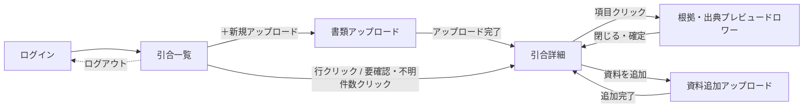

# 仕様書（基本設計）: 引合書整理エージェント

> Vモデル: 基本設計 / 対応する検証: 結合テスト
> 要件（02-requirement.md）を画面に落とし込む。画面構成・画面ごとの機能・モックHTMLを定義する。
> モックは全画面を1つにまとめた [mocks/mockup.html](./mocks/mockup.html) に作成する（画面ID `#SCR-xx` で各画面へアンカー移動）。
>
> **画面レイアウト方針**: 全画面（ログイン画面を除く）で「左サイドバー + 上部ヘッダー（パンくず）+ メインコンテンツ」の3分割レイアウトに統一する。サイドバーは「主要機能」（引合一覧・新規アップロード・確認中／確定済みフィルタ）と「今後対応」（設定、見積書作成・発行）をグループ分けして表示し、下部にユーザー情報・ログアウトを配置する。常に「現在地」「次に取るべき操作」が分かる状態を保つ。
> **補助導線**: ヘルプはサイドバーには置かず、全画面共通で右下に固定表示する「？」アイコン（ヘルプFAB）として提供する。将来的にはクリック時にドロワー等で操作方法・FAQ・この画面について・問い合わせを表示する想定だが、本MVPではアイコン表示のみとする。

## 1. 画面構成（サイトマップ）

| 画面ID | 画面名 | 目的 | 対応機能(②) | モック |
|--------|-------|------|-------------|-------|
| SCR-00 | ログイン | メールアドレス／パスワードでログインする（ローカルPoCの単一ユーザーログイン） | 非機能要件（4章、認証はMVPでは簡易実装） | [mockup.html#login-screen](./mocks/mockup.html#login-screen) |
| SCR-01 | 引合一覧 | 全引合を状態（確認中／確定済み）別に一覧表示し、新規アップロードの起点となる | FUNC-01（起点）、FUNC-07（状態集計表示） | [mockup.html#SCR-01](./mocks/mockup.html#SCR-01) |
| SCR-02 | 書類アップロード | Excel／PDF／メールを一括アップロードし、新しい引合を自動生成する | FUNC-01 | [mockup.html#SCR-02](./mocks/mockup.html#SCR-02) |
| SCR-03 | 引合詳細（サマリー・確認） | 案件サマリー→品目一覧→その他特記事項の順で引合内容を一覧し、確認・修正・確定・出力を行うハブ画面 | FUNC-02, FUNC-03, FUNC-05, FUNC-06, FUNC-07, FUNC-08, FUNC-09 | [mockup.html#SCR-03](./mocks/mockup.html#SCR-03) |
| SCR-04 | 項目根拠・出典プレビュードロワー | 選択した項目の抽出根拠を、資料形式に応じたプレビュー（PDFページ表示等）とともに確認し、値を修正できる | FUNC-06, FUNC-08 | [mockup.html#drawer-overlay](./mocks/mockup.html#drawer-overlay) |
| SCR-05 | 資料追加アップロード | 既存の引合に追加資料をアップロードする | FUNC-01（追加） | [mockup.html#SCR-05](./mocks/mockup.html#SCR-05) |

### 画面遷移図

## 2. 画面ごとの仕様

### SCR-00 ログイン

**目的**: 営業担当者がメールアドレス・パスワードでログインする。ローカル・単一ユーザーのPoCを前提とした簡易ログインであり、サイドバー等のアプリシェルは持たない単独画面とする。

**UI要素**

| 要素 | 説明 | 位置 | 対応機能(②) |
|------|------|------|-------------|
| ロゴ／プロダクト名 | 「引合書整理エージェント」 | カード上部中央 | - |
| メールアドレス入力 | テキスト入力欄 | カード中央 | 非機能要件（4章） |
| パスワード入力 | パスワード入力欄（マスク表示） | カード中央 | 非機能要件（4章） |
| ログインボタン | 主要アクション（primaryボタン1つのみ） | カード下部 | 非機能要件（4章） |

**操作とインタラクション**

| 操作 | UI要素 | 挙動 | 対応機能(②) |
|------|--------|------|-------------|
| ログインボタンクリック | ログインボタン | 入力値を検証しSCR-01（引合一覧）へ遷移する | 非機能要件（4章） |
| サイドバーのログアウトボタンクリック（SCR-01〜05側） | ログアウトボタン | SCR-00に戻る | 非機能要件（4章） |

**エラー・例外表示**

| ケース | トリガー | 画面の挙動・表示 | 対応する要件(②) |
|--------|---------|----------------|----------------|
| メールアドレス／パスワード未入力 | ログインボタン押下時に空欄がある | 該当入力欄の枠を強調し、「メールアドレスとパスワードを入力してください」を表示 | 非機能要件（4章） |
| 認証失敗 | 誤ったメールアドレス／パスワードでログイン | カード内に「メールアドレスまたはパスワードが正しくありません」を表示し、入力欄はクリアしない | 非機能要件（4章） |

**モック**: [mockup.html#login-screen](./mocks/mockup.html#login-screen)

---

### SCR-01 引合一覧

**目的**: 全引合を一覧表示し、状態（確認中／確定済み）・要確認／不明件数を一目で把握できるようにする。新規アップロードの起点であり、ログイン後の既定表示画面。

**UI要素**

| 要素 | 説明 | 位置 | 対応機能(②) |
|------|------|------|-------------|
| サイドバー | 【主要機能】引合一覧／＋新規アップロード／確認中フィルタ／確定済みフィルタ（各件数バッジ付き）。【今後対応】設定、見積書作成・発行（いずれも「今後対応」バッジ付きでグレーアウト・非活性・ホバー表現なし・クリック不可）。下部にユーザー情報・ログアウト | 画面左（全画面共通） | FUNC-01, FUNC-07（見積書作成・発行はOut of Scope、将来構想の提示のみ） |
| ヘルプFAB | 右下固定の「？」円形ボタン（補助導線）。将来的にクリックで操作方法／FAQ／この画面について／問い合わせをドロワー等で表示予定。MVPではアイコン表示のみ | 画面右下（全画面共通、ログイン画面含む） | - |
| パンくず | 「引合一覧」を表示 | ヘッダー | - |
| フィルタタブ | すべて／確認中／確定済み（件数付き） | 一覧上部 | FUNC-07 |
| 引合テーブル | 依頼元企業・案件名・依頼日時・状態バッジ・要確認件数・不明件数・最終更新日時の列。行全体がクリック可能で、ホバー時に背景色が変わり、行末に「›」を表示してクリック可能性を示す | 画面中央 | FUNC-05, FUNC-07 |
| 要確認／不明の件数リンク | 数値そのものがクリック可能なリンク（下線表示） | テーブル内 | FUNC-07 |
| 空状態 | イラスト（書類＋虫眼鏡アイコン）＋説明文＋「最初の書類をアップロード」CTAボタン | 一覧が0件の場合、テーブルの代わりに表示 | FUNC-01 |

**操作とインタラクション**

| 操作 | UI要素 | 挙動 | 対応機能(②) |
|------|--------|------|-------------|
| 「＋新規アップロード」クリック（サイドバー／ヘッダー） | サイドバー項目 or ページ内ボタン | SCR-02へ遷移 | FUNC-01 |
| 行クリック（行内のリンク以外の領域） | テーブル行 | SCR-03（当該引合の詳細）へ遷移 | FUNC-05 |
| 要確認／不明の件数リンククリック | 件数リンク | SCR-03へ遷移し、該当する要確認／不明項目の一覧に自動スクロール・絞り込みした状態で表示 | FUNC-07 |
| フィルタタブ／サイドバーの確認中・確定済みクリック | フィルタタブ、サイドバー項目 | 一覧を状態で絞り込み表示 | FUNC-07 |
| 空状態のCTAクリック | CTAボタン | SCR-02へ遷移 | FUNC-01 |

**エラー・例外表示**

| ケース | トリガー | 画面の挙動・表示 | 対応する要件(②) |
|--------|---------|----------------|----------------|
| 引合が0件 | 初回利用時・全件削除後等 | イラスト付き空状態＋CTAボタンを表示し、次に取るべき操作（アップロード）を明確に示す | FUNC-01 |

**モック**: [mockup.html#SCR-01](./mocks/mockup.html#SCR-01)

---

### SCR-02 書類アップロード

**目的**: Excel／PDF／メールをドラッグ&ドロップまたは選択でアップロードし、事前の案件作成なしに新しい引合を自動生成する。

**UI要素**

| 要素 | 説明 | 位置 | 対応機能(②) |
|------|------|------|-------------|
| 対応形式チップ | 「Excel（.xlsx）」「PDF（.pdf）」「メール（.eml）」の3チップ | ドロップ領域の上 | FUNC-01 |
| ドロップ領域 | 大きめの破線枠＋アップロードアイコン＋「ここにドラッグ＆ドロップ」＋「または」＋「ファイルを選択」ボタン。ドラッグ中は枠と背景を強調表示（dragover状態） | 画面中央、大きく確保 | FUNC-01 |
| 選択済みファイルリスト | ファイル形式アイコン＋ファイル名＋削除ボタン | ドロップ領域の下 | FUNC-01 |
| インラインエラー | 非対応形式ファイルの拒否メッセージ（⚠️アイコン付き） | ファイルリストの上 | FUNC-01 |
| 「アップロード開始」ボタン＋進捗表示 | ボタンの右隣に進捗バーと「AIが資料を解析しています…」の状態テキストを表示し、アクションの近くで処理状況が分かるようにする | 画面下部 | FUNC-01, FUNC-02〜05（解析処理） |

**操作とインタラクション**

| 操作 | UI要素 | 挙動 | 対応機能(②) |
|------|--------|------|-------------|
| ファイルのドラッグ&ドロップ／「ファイルを選択」 | ドロップ領域 | ファイルをリストに追加。ドラッグ中は領域の見た目を変化させ、ドロップ可能であることを示す | FUNC-01 |
| ファイルリストの「削除」クリック | 削除ボタン | 該当ファイルをリストから除去 | FUNC-01 |
| 「アップロード開始」クリック | ボタン | アップロードを実行し、進捗バー・解析中メッセージを表示。完了後、新規に生成された引合のSCR-03へ自動遷移 | FUNC-01〜05 |

**エラー・例外表示**

| ケース | トリガー | 画面の挙動・表示 | 対応する要件(②) |
|--------|---------|----------------|----------------|
| 非対応形式ファイルのドロップ／選択 | xlsx/pdf/eml以外のファイル | 該当ファイルをリストに追加せず、ドロップ領域直下に「対応していない形式です（Excel／PDF／メールのみ）」を表示 | FUNC-01 |
| ファイル未選択で「アップロード開始」 | ファイルリストが空 | ボタンを非活性表示にし、押せないことを明示 | FUNC-01 |

**モック**: [mockup.html#SCR-02](./mocks/mockup.html#SCR-02)

---

### SCR-03 引合詳細（サマリー・確認）

**目的**: 「上段：案件サマリー／中段：品目一覧／下段：その他特記事項」の3段構成で引合内容を一覧性高く表示し、担当者が不明・要確認箇所だけを確認・修正して確定・出力できるようにする（本システムの中核画面）。

**UI要素**

| 要素 | 説明 | 位置 | 対応機能(②) |
|------|------|------|-------------|
| ページヘッダー | 依頼元企業名・案件名・引合ID・依頼日時・状態バッジ | 画面上部 | FUNC-05 |
| 状態凡例（レジェンド） | 「確認不要／？不明／⚠️要確認／🌐Web補完」の4状態を、アイコン＋枠線パターンで統一表示（配色ルールはデザイントークン確定時に正式な色を割り当てる。ワイヤーフレーム段階ではグレー階調・線種で代替表現） | 案件サマリーの直上 | FUNC-07 |
| 案件サマリーテーブル | A項目（依頼元企業〜市況、その他特記事項を除く）をラベル列＋値列の表形式で表示。行にホバーで背景色が変化し、クリック可能であることを示す | 画面上段 | FUNC-02, FUNC-06, FUNC-07 |
| 品目一覧テーブル | B項目（製管方法〜数量）を品目行×列の表形式で表示。要確認セルは太枠＋アイコンで強調 | 画面中段 | FUNC-02, FUNC-06, FUNC-07 |
| その他特記事項（タブ切替） | 「案件全体」／「品目固有」のタブで表示を切替。各特記事項は出典を右側に小さく表示 | 画面下段 | FUNC-02 |
| 再編集時の注意バナー | 確定済み状態で値を修正した場合に表示 | 特記事項の下 | FUNC-09 |
| アクションバー | 「📎資料を追加」「⬇Excelをダウンロード」「✔確定する」の3ボタン（primaryは「確定する」のみ） | 画面下部 | FUNC-01, FUNC-05, FUNC-09 |

**操作とインタラクション**

| 操作 | UI要素 | 挙動 | 対応機能(②) |
|------|--------|------|-------------|
| 案件サマリーの行クリック／品目一覧の値セルクリック | テーブル行・セル | SCR-04（根拠・出典プレビュードロワー）を画面右側からスライド表示 | FUNC-06, FUNC-08 |
| その他特記事項のタブクリック | 「案件全体」／「品目固有」タブ | 表示するリストを切替 | FUNC-02 |
| 「資料を追加」クリック | アクションバーのボタン | SCR-05へ遷移 | FUNC-01 |
| 「Excelをダウンロード」クリック | アクションバーのボタン | 現在の構造化JSONの状態（確認中／確定済み）に応じ、`_draft`／`_final`のファイル名でExcelを生成・ダウンロード | FUNC-05 |
| 「確定する」クリック | アクションバーのボタン（確認中状態のときのみ活性） | 確認ダイアログ表示後、状態が「確定済み」に変わり、バッジ表示が更新される | FUNC-09 |

**エラー・例外表示**

| ケース | トリガー | 画面の挙動・表示 | 対応する要件(②) |
|--------|---------|----------------|----------------|
| 項目が「不明」 | 資料から抽出できず値が存在しない | セルに「？ 不明」を破線枠＋グレー表示で示す | FUNC-07 |
| 項目が「要確認」 | 矛盾・複数候補・曖昧・パース失敗のいずれか | セルに「⚠️ 要確認」を太枠で強調表示し、候補件数タグを付与。クリックでSCR-04に理由・候補値・出典を表示 | FUNC-07 |
| Web補完された項目 | FUNC-04によりWeb検索で補完 | 値に点線の下線＋🌐アイコンと「Web補完」タグを付与し、直接抽出値と区別する | FUNC-04, FUNC-06 |
| 確定済み状態での再編集 | 確定済みの項目をSCR-04経由で修正 | 特記事項の下に「確定済みの内容を変更しました。再度Excelを出力してください」の注意バナーを表示（編集自体は禁止しない） | FUNC-09 |
| 不明項目のある品目でのExcel出力 | 品目にmissingが残っている状態でダウンロード | 出力はブロックせず、該当セルは「不明」の表示のままExcelに出力する | FUNC-05 |

**モック**: [mockup.html#SCR-03](./mocks/mockup.html#SCR-03)

---

### SCR-04 項目根拠・出典プレビュードロワー

**目的**: 選択した項目について、担当者が元資料を開き直さずに「なぜこの値になったのか」を画面内で確認し、必要なら値を修正できるようにする。出典クリックで別ページに遷移せず、画面内（右側ドロワー）でプレビューする。

**UI要素**

| 要素 | 説明 | 位置 | 対応機能(②) |
|------|------|------|-------------|
| ドロワーヘッダー | 項目名・状態バッジ・要確認理由（矛盾／複数候補／曖昧／パース失敗のいずれか）・閉じるボタン | ドロワー上部 | FUNC-06, FUNC-07 |
| 候補タブ | 複数候補がある場合、候補ごとにタブ（例:「候補1（PDF）」「候補2（EML）」）で切替 | ヘッダー直下 | FUNC-06 |
| 出典プレビューボックス | 資料形式に応じたプレビュー領域。PDF: ページ表示＋該当テキストのハイライト＋ページ送り、Excel: シート名・セル位置＋該当セル周辺の簡易表示、EML: 件名／本文の該当部分の抜粋表示、Web: 参照元ページ情報（URL・名称・参照日時）。同一のプレビューUI構造をPDF/Excel/EML/Webで共通化し、将来の拡張に備える | ドロワー中央 | FUNC-06 |
| 候補値リスト | 候補値＋出典要約をカード表示、クリックで選択状態（枠強調）に切替 | プレビューの下 | FUNC-06, FUNC-08 |
| 修正入力欄 | 確定する値のテキスト入力（候補選択で自動入力、手動編集も可） | 候補リストの下 | FUNC-08 |
| フッターボタン | 「閉じる」「この値を確定する」 | ドロワー下部 | FUNC-08 |

**操作とインタラクション**

| 操作 | UI要素 | 挙動 | 対応機能(②) |
|------|--------|------|-------------|
| 候補タブ切替 | 候補タブ | 対応する出典プレビューに切替表示 | FUNC-06 |
| PDFプレビューのページ送り | ページ送りボタン（‹ ›） | プレビュー内のページを前後に切替 | FUNC-06 |
| 候補値カードクリック | 候補カード | カードを選択状態にし、修正入力欄に値を反映 | FUNC-08 |
| 「この値を確定する」クリック | フッターボタン | 入力値を構造化JSONに反映し、ドロワーを閉じてSCR-03の表示を更新（状態が「確認不要」に変わる） | FUNC-08 |
| 「閉じる」／オーバーレイ外クリック | フッターボタン／背景 | 変更を反映せずドロワーを閉じる | FUNC-08 |

**エラー・例外表示**

| ケース | トリガー | 画面の挙動・表示 | 対応する要件(②) |
|--------|---------|----------------|----------------|
| 修正入力欄を空のまま確定 | 入力値なしで「この値を確定する」 | 値を空で確定した場合は状態が「不明」に戻ることを示す確認メッセージを表示 | FUNC-08 |
| プレビューが表示できない資料形式（将来拡張分） | 未対応の出典形式 | 「このファイル形式のプレビューは未対応です」を表示し、ファイル名・該当箇所のテキスト情報のみ表示する（MVPではPDF/Excel/EML/Webを対象とし、この分岐は将来拡張の受け皿） | FUNC-06 |

**モック**: [mockup.html#drawer-overlay](./mocks/mockup.html#drawer-overlay)（SCR-03内から `openDrawer()` で表示）

---

### SCR-05 資料追加アップロード

**目的**: 既存の引合に対し、担当者が明示的な操作で追加資料をアップロードする（AIによる自動紐付けは行わない）。

**UI要素**

| 要素 | 説明 | 位置 | 対応機能(②) |
|------|------|------|-------------|
| 対象引合の表示 | 依頼元企業・案件名・引合IDの確認表示 | 画面上部 | FUNC-01 |
| 対応形式チップ／ドロップ領域／ファイルリスト | SCR-02と同一構成 | 画面中央 | FUNC-01 |
| 「追加する」ボタン | 主要アクション | 画面下部 | FUNC-01 |

**操作とインタラクション**

| 操作 | UI要素 | 挙動 | 対応機能(②) |
|------|--------|------|-------------|
| ファイル追加→「追加する」クリック | ボタン | 追加資料を対象引合に紐づけ、AI処理を再実行してSCR-03に戻る | FUNC-01, FUNC-02〜05 |

**エラー・例外表示**

| ケース | トリガー | 画面の挙動・表示 | 対応する要件(②) |
|--------|---------|----------------|----------------|
| 非対応形式ファイルのドロップ／選択 | xlsx/pdf/eml以外のファイル | SCR-02と同様のインラインエラーを表示 | FUNC-01 |

**モック**: [mockup.html#SCR-05](./mocks/mockup.html#SCR-05)

---

## 3. デザイントークン

> ⚠️ ここで決めたデザインが Build 以降のUIの基準として固定される。**本レビュー時点では未確定**（この章は次のステップ「デザイン適用」で、方向性の異なる3案を提示し、選定されたトークンをここに記録する）。
> 現在の `mocks/mockup.html` はワイヤーフレーム段階のグレースケール表現であり、状態表示（確認不要／不明／要確認／Web補完）は色ではなく枠線の太さ・線種（実線・破線・点線）で代替表現している。デザイン適用時に、この4状態を含めた配色ルールを正式に確定する。

## 4. モックHTML

全画面を1つにまとめた [mocks/mockup.html](./mocks/mockup.html) に、単一ファイル完結（外部CSS/JS依存なし）で作成した。

- ログイン（`#login-screen`）以外の画面は、サイドバー＋ヘッダー（パンくず）＋メインコンテンツのアプリシェル（`#shell`）内に格納
- 各画面は `<section id="SCR-01">` 等の画面IDを持ち、本文の各画面仕様からリンクしている
- SCR-04（根拠・出典プレビュードロワー）は右側スライドドロワーとして実装し、SCR-03内の項目クリックで表示する
- 画面右上の「Mock Nav」は本番UIではなく、レビュー時に全画面へ直接ジャンプするための確認用ナビゲーション
- 実データは不要なためダミーデータで作成（sample-dataの東西石油開発の案件を例として使用）

---

## 次のステップ

→ デザイン適用（3章のデザイントークン確定）を行った後、`04-db`（DB設計書・詳細設計）でテーブル設計とCREATE文を作成する
