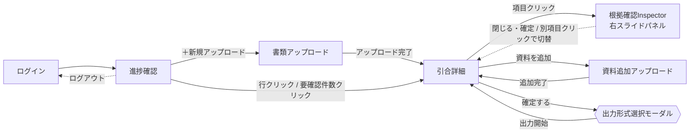

# 仕様書（基本設計）: 引合書整理エージェント

> Vモデル: 基本設計 / 対応する検証: 結合テスト
> 要件（02-requirement.md）を画面に落とし込む。画面構成・画面ごとの機能・モックHTMLを定義する。
> モックは全画面を1つにまとめた [mocks/mockup.html](./mocks/mockup.html) に作成する（画面ID `#SCR-xx` で各画面へアンカー移動）。
>
> **画面レイアウト方針**: 全画面（ログイン画面を除く）で「左サイドバー + 上部ヘッダー（パンくず）+ メインコンテンツ」の3分割レイアウトに統一する。常に「現在地」「次に取るべき操作」が分かる状態を保つ。
> **補助導線**: ヘルプはサイドバーには置かず、全画面共通で右下に固定表示する「？」アイコン（ヘルプFAB）として提供する。将来的にはクリック時にドロワー等で操作方法・FAQ・この画面について・問い合わせを表示する想定だが、本MVPではアイコン表示のみとする。
>
> **デザイン方針（配色・トーン）**: 黒・グレーを基調とした無彩色ベースに、濃淡のグラデーションで階調をつけ、業務ツールとしての信頼感・落ち着きを重視する。派手な装飾は避け、文字量よりもレイアウト・アイコン・余白・視線誘導で理解できるUIを目指す。ただし状態表示（要確認／Web補完）は識別性を優先し、無彩色の中で必要最低限のアクセントカラー（琥珀＝要確認、ティール＝Web補完〔情報の由来を示すタグ〕、グリーン＝確定済み）を用いる。要確認の理由（不明・矛盾・複数候補・曖昧・パース失敗）はバッジの色分けでは区別せず、右側Inspector内で日本語の理由として提示する。詳細は「4. ステータス表現」を参照。
>
> **サイドバー方針**: 黒〜チャコールグレーの控えめなグラデーション背景に、アイコン＋ラベルのナビゲーションを配置するモダンなSaaS型サイドバーとする。項目は上から「進捗確認／新規アップロード／見積書作成・発行／設定」の4つのみのフラットな並びとし、「今後対応」等の注記ラベルは表示しない（見積書作成・発行と設定は現時点では遷移しないプレースホルダーだが、項目自体は常に表示する）。選択中の項目は左端のアクセントバーと明るい背景で示す。下部にはユーザー情報とログアウトボタンを固定表示する。サイドバーはヘッダー付近のトグルボタンで開閉可能とし、開いた状態はアイコン＋ラベル、閉じた状態はアイコンのみとする。開閉はCSSの幅トランジションで滑らかに行い、メインコンテンツ側のガタつき（レイアウトシフト）を抑える。ヘルプはサイドバーに置かず、常に右下のヘルプFABに集約する。デスクトップでの長時間業務利用を前提に、十分なコントラストと余白を確保する。
>
> **右側Inspector（根拠確認パネル）方針**: 根拠確認・値確定（SCR-04）は、SCR-03の右側に常時居座る固定パネルではなく、案件サマリー・品目一覧の項目をクリックしたときだけ右から現れるスライド式のサイドパネルとして実装する。通常時、詳細画面（SCR-03）はメイン情報を画面幅いっぱいに広く表示する。パネルは画面全体の約1/3幅（`min(34vw, 620px)`、最小380px）を目安とし、背景を暗転させるオーバーレイは使用しない（左側の案件情報は開いている間も見える・操作できる状態を保つ）。クリックした項目の状態に応じて、確認不要の項目は値・出典・根拠プレビューのみを閲覧する読み取り専用の「根拠確認モード」、要確認の項目は候補比較・出典プレビュー比較・値の確定までを行える「確認・修正モード」で開く。一覧の「要確認」件数や詳細画面上部のステータスサマリーから開いた場合は、要確認理由（不明・矛盾・複数候補・曖昧・パース失敗）ごとにグルーピングした一覧（overviewモード）がまず表示され、項目をクリックすると確認・修正モードに遷移し、「‹ 戻る」で一覧に戻れる。Web補完（情報の由来）は要確認理由とは別に、各項目内のタグとして示す。モーダルは削除確認・確定確認・ログアウト確認・出力形式選択などの限定用途にのみ使用する。

## 1. 画面構成（サイトマップ）

| 画面ID | 画面名 | 目的 | 対応機能(②) | モック |
|--------|-------|------|-------------|-------|
| SCR-00 | ログイン | メールアドレス／パスワードでログインする（ローカルPoCの単一ユーザーログイン） | 非機能要件（4章、認証はMVPでは簡易実装） | [mockup.html#login-screen](./mocks/mockup.html#login-screen) |
| SCR-01 | 進捗確認（引合一覧） | 全引合を状態（確認中／確定済み）別に一覧表示し、新規アップロードの起点となる | FUNC-01（起点）、FUNC-07（状態集計表示） | [mockup.html#SCR-01](./mocks/mockup.html#SCR-01) |
| SCR-02 | 書類アップロード | Excel／PDF／メールを一括アップロードし、新しい引合を自動生成する | FUNC-01 | [mockup.html#SCR-02](./mocks/mockup.html#SCR-02) |
| SCR-03 | 引合詳細（サマリー・確認） | 案件サマリー→品目一覧→その他特記事項の順で引合内容を一覧性高く表示するハブ画面。通常はメイン情報を画面幅いっぱいに表示し、項目クリック時のみ右からInspector（SCR-04）がスライド表示される（確認不要項目は閲覧のみ、要確認項目は確認・修正ができる） | FUNC-02, FUNC-03, FUNC-04, FUNC-05, FUNC-06, FUNC-07, FUNC-08, FUNC-09 | [mockup.html#SCR-03](./mocks/mockup.html#SCR-03) |
| SCR-04 | 根拠確認Inspector（右スライド式サイドパネル） | 選択した項目の抽出根拠を、資料形式に応じたプレビュー（PDFページ・メール本文・Excelセル・Web参照）とともに確認し、要確認項目は値を修正・確定できる。項目クリック時のみ画面右から幅約1/3でスライド表示され、背景は暗転しない | FUNC-04, FUNC-06, FUNC-08 | [mockup.html#inspector](./mocks/mockup.html#SCR-03) |
| SCR-05 | 資料追加アップロード | 既存の引合に追加資料をアップロードする | FUNC-01（追加） | [mockup.html#SCR-05](./mocks/mockup.html#SCR-05) |

### 画面遷移図

## 2. 画面ごとの仕様

### SCR-00 ログイン

**目的**: 営業担当者がメールアドレス・パスワードでログインする。ローカル・単一ユーザーのPoCを前提とした簡易ログインであり、サイドバー等のアプリシェルは持たない単独画面とする。

**UI要素**

| 要素 | 説明 | 位置 | 対応機能(②) |
|------|------|------|-------------|
| ロゴマーク／プロダクト名 | 黒基調のロゴマーク＋「引合書整理エージェント」 | カード上部中央 | - |
| メールアドレス入力 | テキスト入力欄 | カード中央 | 非機能要件（4章） |
| パスワード入力 | パスワード入力欄（マスク表示） | カード中央 | 非機能要件（4章） |
| ログインボタン | 主要アクション（primaryボタン1つのみ） | カード下部 | 非機能要件（4章） |

**操作とインタラクション**

| 操作 | UI要素 | 挙動 | 対応機能(②) |
|------|--------|------|-------------|
| ログインボタンクリック | ログインボタン | 入力値を検証しSCR-01（引合一覧）へ遷移する | 非機能要件（4章） |
| サイドバーのログアウトボタンクリック（SCR-01〜05側） | ログアウトボタン | 「ログアウトしますか？」の確認モーダル（限定用途モーダル）を表示し、「ログアウト」選択でSCR-00に戻る | 非機能要件（4章） |

**エラー・例外表示**

| ケース | トリガー | 画面の挙動・表示 | 対応する要件(②) |
|--------|---------|----------------|----------------|
| メールアドレス／パスワード未入力 | ログインボタン押下時に空欄がある | 該当入力欄の枠を強調し、「メールアドレスとパスワードを入力してください」を表示 | 非機能要件（4章） |
| 認証失敗 | 誤ったメールアドレス／パスワードでログイン | カード内に「メールアドレスまたはパスワードが正しくありません」を表示し、入力欄はクリアしない | 非機能要件（4章） |

**モック**: [mockup.html#login-screen](./mocks/mockup.html#login-screen)

---

### SCR-01 進捗確認（引合一覧）

**目的**: 全引合を一覧表示し、状態（確認中／確定済み）・要確認件数を一目で把握できるようにする。新規アップロードの起点であり、ログイン後の既定表示画面。担当者にとっての行動は「確認する」の一択であるため、一覧上のステータス種別は「要確認」1本に統一し、要確認理由（不明・矛盾・複数候補・曖昧・パース失敗）の内訳は詳細画面（SCR-03）・右側Inspector（SCR-04）側で確認する構成とする。Web補完（情報の由来）は要確認理由とは別に扱い、詳細画面で個別に示す。

**UI要素**

| 要素 | 説明 | 位置 | 対応機能(②) |
|------|------|------|-------------|
| サイドバー | 黒〜チャコールグラデーションの開閉式サイドバー。上から「進捗確認／新規アップロード／見積書作成・発行／設定」のフラットな4項目（「今後対応」等の注記ラベルは表示しない）。下部にユーザー情報・ログアウトを固定表示。ヘッダー付近のトグルボタンで開閉でき、閉じるとアイコンのみの幅に縮小する | 画面左（全画面共通） | FUNC-01, FUNC-07（見積書作成・発行・設定はOut of Scope、項目としての提示のみ） |
| ヘルプFAB | 右下固定の「？」円形ボタン（補助導線）。将来的にクリックで操作方法／FAQ／この画面について／問い合わせをドロワー等で表示予定。MVPではアイコン表示のみ | 画面右下（全画面共通、ログイン画面含む） | - |
| パンくず | 「進捗確認」を表示 | ヘッダー | - |
| フィルタタブ | すべて／確認中／確定済み（件数付き） | 一覧上部 | FUNC-07 |
| 引合テーブル | 依頼元企業・案件名・依頼日時・状態バッジ・要確認件数・最終更新日時の列。行全体がクリック可能で、ホバー時に背景色が変わり、行末に「›」を表示してクリック可能性を示す | 画面中央 | FUNC-05, FUNC-07 |
| 要確認の件数バッジ | 理由（不明・矛盾・複数候補・曖昧・パース失敗）を問わず、要確認が必要な項目の件数をまとめたクリック可能なバッジ（琥珀）として表示し、一覧上で「確認が必要かどうか」だけを一目で判断できるようにする。0件はグレーの控えめな表示にする | テーブル内 | FUNC-07 |
| 空状態 | 大きめのアイコン（書類＋虫眼鏡）＋短い見出し＋CTAボタンのみで構成し、説明文は持たせない。レイアウトとアイコンで意味を伝える。表示内容は件数の状況に応じて3パターンに分かれる（下記操作とインタラクション／エラー・例外表示を参照） | 引合の総件数が0件、または選択中フィルタの結果が0件の場合、テーブルの代わりに表示 | FUNC-01 |

**操作とインタラクション**

| 操作 | UI要素 | 挙動 | 対応機能(②) |
|------|--------|------|-------------|
| 「進捗確認」／「＋新規アップロード」クリック（サイドバー／ヘッダー） | サイドバー項目 or ページ内ボタン | SCR-01／SCR-02へ遷移 | FUNC-01 |
| 「見積書作成・発行」「設定」クリック | サイドバー項目 | 遷移せず、「準備中の機能です」という短いトースト通知を表示する（プレースホルダー） | - |
| サイドバー開閉トグルクリック | トグルボタン | サイドバーをアイコン＋ラベル表示／アイコンのみ表示で切り替える。幅はCSSトランジションで滑らかに変化し、メインコンテンツのガタつきを抑える | - |
| 行クリック（行内のリンク以外の領域） | テーブル行 | SCR-03（当該引合の詳細）へ遷移 | FUNC-05 |
| 要確認の件数バッジクリック | 件数バッジ | SCR-03へ遷移し、右側Inspectorが要確認一覧（理由〔不明・矛盾・複数候補・曖昧・パース失敗〕ごとにグルーピング）を表示した状態で自動的に開く | FUNC-07 |
| フィルタタブクリック | フィルタタブ | 一覧を状態で絞り込み表示 | FUNC-07 |
| 空状態のCTAクリック | CTAボタン | SCR-02へ遷移 | FUNC-01 |

**エラー・例外表示**

一覧の空状態は、引合の総件数と選択中フィルタの結果件数によって次の3パターンに分かれる。

| ケース | トリガー | 画面の挙動・表示 | 対応する要件(②) |
|--------|---------|----------------|----------------|
| 引合の総件数が0件 | 初回利用時・全件削除後等（フィルタは問わない） | 一覧テーブルを非表示にし、イラスト付き空状態「まだ引合がありません」＋CTAボタン「＋ 書類をアップロード」を表示。次に取るべき操作（アップロード）を明確に示す | FUNC-01 |
| 総件数は1件以上あるが、選択中フィルタの絞り込み結果が0件 | 例: 全体3件のうち「確認中」タブを選択したが該当0件 | 一覧テーブルを非表示にし、フィルタ名に応じた空状態（「確認中の引合はありません」／「確定済みの引合はありません」）を表示する。他のフィルタには該当データが存在するため、アップロードCTAボタンは表示しない | FUNC-01, FUNC-07 |
| 総件数が1件以上あり、選択中フィルタの結果も1件以上ある | 通常時 | 一覧テーブルのみを表示し、空状態は完全に非表示にする | FUNC-01, FUNC-07 |

**モック**: [mockup.html#SCR-01](./mocks/mockup.html#SCR-01)

---

### SCR-02 書類アップロード

**目的**: Excel／PDF／メールをドラッグ&ドロップまたは選択でアップロードし、事前の案件作成なしに新しい引合を自動生成する。

**UI要素**

| 要素 | 説明 | 位置 | 対応機能(②) |
|------|------|------|-------------|
| 対応形式チップ | 「Excel（.xlsx）」「PDF（.pdf）」「メール（.eml）」のコンパクトな3チップ | ドロップ領域の上 | FUNC-01 |
| ドロップ領域（主役） | 画面内で最も大きい破線枠のカード。アップロードアイコン＋「ここにドラッグ＆ドロップ」の大見出し＋補助的な「ファイルを選択」ボタン。「ファイルを選択」はあくまで代替手段としてD&Dより小さく配置する。ドラッグ中は枠を実線化し背景を強調（dragover状態） | 画面中央、大きく確保 | FUNC-01 |
| 選択済みファイルリスト | ファイル形式アイコン＋ファイル名＋削除ボタン | ドロップ領域の下 | FUNC-01 |
| インラインエラー | 非対応形式ファイルの拒否メッセージ（⚠️アイコン＋アラート配色） | ファイルリストの上 | FUNC-01 |
| 「アップロード開始」ボタン＋進捗・状態インジケーター | ボタンの右隣にスピナー＋進捗バー＋進捗率（%）の数値表示＋短い状態テキストを配置し、バーの伸び・％表示・状態テキストの3つが連動して進む。状態テキストは処理段階に応じて「アップロード中 → AI解析中 → 構造化中 → 要確認項目整理中 → 完了」の順に切り替わる | 画面下部 | FUNC-01, FUNC-02〜05（解析処理） |

**操作とインタラクション**

| 操作 | UI要素 | 挙動 | 対応機能(②) |
|------|--------|------|-------------|
| ファイルのドラッグ&ドロップ／「ファイルを選択」 | ドロップ領域 | ファイルをリストに追加。ドラッグ中は領域の見た目を変化させ、ドロップ可能であることを示す | FUNC-01 |
| ファイルリストの「削除」クリック | 削除ボタン | 該当ファイルをリストから除去 | FUNC-01 |
| 「アップロード開始」クリック | ボタン | アップロードを実行し、進捗バー・進捗率（%）・状態テキストを段階的に更新しながら進行度を可視化する。完了後、新規に生成された引合のSCR-03へ自動遷移 | FUNC-01〜05 |

**エラー・例外表示**

| ケース | トリガー | 画面の挙動・表示 | 対応する要件(②) |
|--------|---------|----------------|----------------|
| 非対応形式ファイルのドロップ／選択 | xlsx/pdf/eml以外のファイル | 該当ファイルをリストに追加せず、ドロップ領域直下に「対応していない形式です（Excel／PDF／メールのみ）」を表示 | FUNC-01 |
| ファイル未選択で「アップロード開始」 | ファイルリストが空 | ボタンを非活性表示にし、押せないことを明示 | FUNC-01 |

**モック**: [mockup.html#SCR-02](./mocks/mockup.html#SCR-02)

---

### SCR-03 引合詳細（サマリー・確認）

**目的**: 「案件サマリー→品目一覧→その他特記事項」の3段構成で引合内容を一覧性高く表示し、担当者が要確認箇所を確認・修正して確定・出力できるようにする（本システムの中核画面）。通常時はメイン情報を画面幅いっぱいに広く見せ、項目をクリックしたときだけ右からInspector（SCR-04）がスライド表示される（確認不要項目は閲覧のみの根拠確認モード、要確認項目は候補比較・修正・確定ができる確認・修正モードで開く）。

**UI要素**

| 要素 | 説明 | 位置 | 対応機能(②) |
|------|------|------|-------------|
| ページヘッダー | 依頼元企業名・案件名・引合ID・依頼日時・状態バッジ | 画面上部 | FUNC-05 |
| ステータスサマリー（チップ） | 「要確認／Web補完」の件数チップ。要確認チップはクリック可能で、右側Inspectorを要確認理由別の内訳一覧（overviewモード）で開く。Web補完チップは情報の由来を示す参考表示でクリック不可 | 案件サマリーの直上 | FUNC-07 |
| 案件サマリー（表形式） | A項目（依頼元企業〜市況、その他特記事項を除く）をラベル列＋値列の情報リスト形式で表示し、比較しやすくする。行にホバーで背景色が変化し、Inspectorで表示中の項目は背景を保持して選択中であることを示す | 上段 | FUNC-02, FUNC-06, FUNC-07 |
| 品目一覧テーブル | B項目（製管方法〜数量）を品目行×列の表形式で表示。要確認のセルはバッジ＋アクセントカラーで強調（理由の違いはバッジの色では区別しない） | 中段 | FUNC-02, FUNC-06, FUNC-07 |
| その他特記事項（タブ切替） | 「案件全体」／「品目固有」のタブで表示を切替。各特記事項は出典を右側に小さく表示 | 下段 | FUNC-02 |
| 再編集時の注意バナー | 確定済み状態で値を修正した場合に表示 | 特記事項の下 | FUNC-09 |
| アクションバー | 「📎資料を追加」／「⬇ 出力する」（確定済み状態のときのみ表示）／「✔確定する」（確認中状態のときのみ表示。確定済み状態になると非表示になり、誤って再度確定操作を行えないようにする）。Excel／Word／PDFの出力形式選択は常設のバー上ではなく、確定後に開く出力形式選択モーダルに集約する | 画面下部 | FUNC-01, FUNC-05, FUNC-09 |
| 根拠確認Inspector（右スライド式サイドパネル） | 項目クリック時のみ表示（確認不要項目は根拠確認モード、要確認項目は確認・修正モード）。詳細はSCR-04を参照 | 画面右側（クリック時にのみスライド表示） | FUNC-06, FUNC-08 |

> **UI表示ラベルの補足**: 02-requirement.mdのA項目#9「エンジ会社」は、要件定義上の項目名としてはBootcamp原文に合わせて「エンジ会社」のまま維持するが、略称でUIラベルとして弱いため、画面表示（SCR-03案件サマリー・SCR-04 Inspector）上のラベルは「エンジニアリング会社」とする。EPC（#10）とは引き続き別項目として扱い、統合はしない。

**操作とインタラクション**

| 操作 | UI要素 | 挙動 | 対応機能(②) |
|------|--------|------|-------------|
| ステータスサマリーの「要確認」チップクリック | サマリーチップ | 右側Inspectorを、要確認理由（不明・矛盾・複数候補・曖昧・パース失敗）ごとの内訳一覧（overviewモード）で開く | FUNC-07 |
| 案件サマリーの行クリック／品目一覧の値セルクリック | テーブル行・セル | 右側Inspectorをクリックした項目の根拠確認表示（detailモード）で開く。Inspectorが既に開いている状態でも、内容だけがその場で切り替わる（再度モーダルの開閉は発生しない） | FUNC-06, FUNC-08 |
| その他特記事項のタブクリック | 「案件全体」／「品目固有」タブ | 表示するリストを切替 | FUNC-02 |
| 「資料を追加」クリック | アクションバーのボタン | SCR-05へ遷移 | FUNC-01 |
| 「確定する」クリック | アクションバーのボタン（確認中状態のときのみ活性） | 確定確認モーダル表示後、状態が「確定済み」に変わり、バッジ表示が更新される。続けて出力形式選択モーダル（Excel／Word／PDF）が自動的に開く | FUNC-09, FUNC-05 |
| 出力形式選択モーダルで形式を選び「出力開始」クリック | モーダル内ボタン | 選択した形式（本モックではExcelのみ機能、Word／PDFは今後対応）でダウンロードを開始し、完了後に「出力しました」という完了トーストを表示する | FUNC-05 |
| 「出力する」クリック（確定済み状態） | アクションバーのボタン | 出力形式選択モーダルを再度開き、確定後いつでも出力し直せるようにする | FUNC-05 |

**エラー・例外表示**

| ケース | トリガー | 画面の挙動・表示 | 対応する要件(②) |
|--------|---------|----------------|----------------|
| 項目が「要確認」（理由: 不明／矛盾／複数候補／曖昧／パース失敗のいずれか） | 資料に記載がない、複数候補がある、資料間で矛盾している、内容が曖昧、抽出時にパースエラーが発生した、のいずれか | セルに「要確認」バッジ（琥珀）のみを表示し、理由の違いをバッジの見た目では区別しない。クリックすると右側Inspectorに理由（日本語）・候補値（ある場合）・出典を表示する | FUNC-07 |
| Web補完された項目 | FUNC-04によりWeb検索で補完 | 値に点線の下線＋「Web補完」タグ（ティール、情報の由来を示す）を付与し、直接抽出値と区別する。要確認理由としては扱わない | FUNC-04, FUNC-06 |
| 確定済み状態での再編集 | 確定済みの項目を右側Inspector経由で修正 | 特記事項の下に「確定済みの内容を変更しました。再度出力してください」の注意バナーを表示（編集自体は禁止しない）。一度も確定していない（確認中）状態での通常の確認・修正では表示しない。再度出力形式選択から出力を完了すると、注意バナーは消える | FUNC-09 |
| 要確認（理由: 不明）の項目がある品目での出力 | 品目に資料から見つからない項目が残っている状態で出力 | 出力はブロックせず、該当セルは値未設定のまま出力する（画面上のバッジは「要確認」のまま） | FUNC-05 |

**モック**: [mockup.html#SCR-03](./mocks/mockup.html#SCR-03)

---

### SCR-04 根拠確認Inspector（右スライド式サイドパネル）

**目的**: 選択した項目について、担当者が元資料を開き直さずに「なぜこの値になったのか」を画面内で確認し、要確認の項目については必要なら値を修正・確定できるようにする。SCR-03上に常設される固定パネルではなく、項目をクリックしたときだけ画面右からスライドして現れるサイドパネルとして実装し、通常時はSCR-03のメイン情報を画面幅いっぱいに使える。背景を暗転させるオーバーレイは使用せず、パネルが開いている間も左側の案件情報は見える・操作できる状態を保つ。パネル幅は画面全体の約1/3（`min(34vw, 620px)`、最小380px）を目安とする。

パネルには「要確認一覧（overviewモード）」と、項目単位で根拠を確認する2種類のdetailモードがある。SCR-01の要確認件数バッジや、SCR-03上部のステータスサマリーチップから開いた場合はoverviewモードで開き、要確認理由（不明・矛盾・複数候補・曖昧・パース失敗）のグループ別に対象項目が一覧表示される。Web補完（情報の由来）は要確認理由とは別に、各項目内でタグとして示す。一覧の項目をクリックするとdetailモードに遷移し、ヘッダーの「‹ 戻る」でoverviewモードに戻れる。案件サマリー・品目一覧の値セルを直接クリックした場合は、その項目のdetailモードが直接開く。

detailモードは、クリックした項目の状態に応じて表示・操作できる範囲が異なる。

- **根拠確認モード（項目の状態が「確認不要」の場合）**: 値・出典・根拠プレビューを閲覧できる読み取り専用モード。候補値の選択UI・値の修正入力欄・「この値を確定する」ボタンは表示しない。Web補完済みの項目はここに「Web補完」タグが表示される。
- **確認・修正モード（項目の状態が「要確認」の場合）**: 要確認理由を表示したうえで、候補値の比較・出典プレビューの比較・値の修正・「この値を確定する」による確定ができる。確定すると、その項目は「確認不要」状態に遷移し、以後は根拠確認モードで開く。Web補完を試みたが一意に特定できなかった項目も、要確認理由（`ambiguous`または`multiple_candidates`）とともにこのモードで開き、Web補完タグは維持したまま候補から選択・確定できる。

**UI要素**

| 要素 | 説明 | 位置 | 対応機能(②) |
|------|------|------|-------------|
| Inspectorヘッダー | overviewモード: 「要確認一覧」の見出しと簡単な案内文。detailモード: 項目名・状態バッジ（確認不要 or 要確認）。根拠確認モードのeyebrowは「根拠確認」、確認・修正モードのeyebrowは「要確認」とし、どちらのモードかを一目で区別できるようにする。要確認の場合は理由を日本語で直下に表示（不明／矛盾／複数候補／曖昧／パース失敗のいずれか、「4. ステータス表現」の定義に基づく）。Web補完（情報の由来）は状態・理由とは別にタグで表示する（根拠確認モード・確認・修正モードのいずれでも、対象項目であれば表示する）。detailモードでoverview経由の場合のみ「‹ 戻る」ボタンを表示 | パネル上部 | FUNC-06, FUNC-07 |
| 要確認一覧（overviewモードの本体） | 要確認理由（不明／矛盾／複数候補／曖昧／パース失敗）のグループごとに、対象項目をラベル＋「›」で並べたクリック可能な行リストを表示する | パネル本体 | FUNC-07 |
| 出典（根拠確認モードの本体） | 確定済みの出典（資料種別アイコン＋ファイル名／該当箇所）を1件、クリック不可の読み取り専用カードで表示する | パネル本体 | FUNC-06 |
| 候補値リスト（確認・修正モードの本体） | 候補値＋出典（資料種別アイコン＋ファイル名／該当箇所）をカードで並べ、クリックで選択状態（枠強調）に切替。候補が0件（理由: 不明）の場合はプレースホルダーを表示する | パネル本体 | FUNC-06, FUNC-08 |
| 出典プレビュー | 選択中（根拠確認モードでは確定済み）の候補について、資料形式に応じたプレビューを表示。PDF: ページ番号＋該当テキストのハイライト＋ページ送り、EML: 件名＋本文該当箇所の抜粋、Excel: シート名・セル位置＋対象セル周辺の簡易グリッド、Web: 参照元情報＋抜粋。共通のプレビューUI構造をPDF/Excel/EML/Webで統一し、将来の拡張に備える | 候補値リストの下 | FUNC-06 |
| 確定する値の入力欄（確認・修正モードのみ） | テキスト入力（候補選択で自動入力、手動編集も可） | パネル下部 | FUNC-08 |
| フッターボタン（確認・修正モードのみ） | 「閉じる」（パネルを閉じる）「この値を確定する」。根拠確認モードではいずれも表示しない | パネル最下部 | FUNC-08 |
| 閉じるボタン（✕） | overview／両detailモード共通。パネルを閉じる | パネル右上 | - |

**操作とインタラクション**

| 操作 | UI要素 | 挙動 | 対応機能(②) |
|------|--------|------|-------------|
| 要確認一覧の行クリック | overview内の行 | 確認・修正モードに遷移し、その項目の候補比較・確定操作を表示する（要確認一覧に載る項目は必ず要確認のため） | FUNC-06, FUNC-08 |
| 「‹ 戻る」クリック | ヘッダーの戻るボタン | detailモードからoverviewモードに戻る（overview経由で開いた場合のみ表示） | - |
| 候補値カードクリック（確認・修正モードのみ） | 候補カード | カードを選択状態にし、出典プレビューと確定する値の入力欄に反映する（連続比較のため画面遷移なし） | FUNC-08 |
| PDFプレビューのページ送り | ページ送りボタン（‹ ›） | プレビュー内のページを前後に切替 | FUNC-06 |
| 「この値を確定する」クリック（確認・修正モードのみ） | フッターボタン | 入力値を構造化JSONに反映し、左側の該当セルの表示を更新（状態が「確認不要」に変わる）。パネルは開いたままで、その項目は根拠確認モード（読み取り専用）に切り替わる。overview経由の場合は「‹ 戻る」で次の項目を続けて選べる | FUNC-08 |
| 左側で別の項目をクリック | 案件サマリー行／品目一覧セル | Inspectorが開いた状態のまま、内容が新しい項目にその場で切り替わる（クリックした項目の状態に応じて根拠確認モード／確認・修正モードのいずれかで表示） | FUNC-06, FUNC-08 |
| 「閉じる」（確認・修正モード）／✕クリック | フッターボタン／ヘッダーの✕ | 変更を反映せずパネルを閉じる（画面右へスライドして消える） | FUNC-08 |

**エラー・例外表示**

| ケース | トリガー | 画面の挙動・表示 | 対応する要件(②) |
|--------|---------|----------------|----------------|
| 修正入力欄を空のまま確定 | 入力値なしで「この値を確定する」 | 値を空で確定した場合は状態が「要確認（理由: 不明）」に戻ることを示す確認メッセージを表示 | FUNC-08 |
| 候補が0件（理由: 不明） | 資料に記載が見つからない | 候補値リストの位置に「候補となる記載が見つかりませんでした」を表示し、入力欄から直接値を確定できるようにする | FUNC-06 |
| 確認が必要な項目が0件 | すべて確認不要の状態 | overviewモードに「確認が必要な項目はありません」を表示する | - |
| プレビューが表示できない資料形式（将来拡張分） | 未対応の出典形式 | 「このファイル形式のプレビューは未対応です」を表示し、ファイル名・該当箇所のテキスト情報のみ表示する（MVPではPDF/Excel/EML/Webを対象とし、この分岐は将来拡張の受け皿） | FUNC-06 |

**モック**: [mockup.html#SCR-03](./mocks/mockup.html#SCR-03) の `#inspector`（`openInspectorOverview()` / `openInspectorField()` で表示切替）

---

### SCR-05 資料追加アップロード

**目的**: 既存の引合に対し、担当者が明示的な操作で追加資料をアップロードする（AIによる自動紐付けは行わない）。

**UI要素**

| 要素 | 説明 | 位置 | 対応機能(②) |
|------|------|------|-------------|
| 対象引合の表示 | 依頼元企業・案件名・引合IDの確認表示 | 画面上部 | FUNC-01 |
| 対応形式チップ／ドロップ領域／ファイルリスト | SCR-02と同一構成 | 画面中央 | FUNC-01 |
| 「追加する」ボタン | 主要アクション | 画面下部 | FUNC-01 |

**操作とインタラクション**

| 操作 | UI要素 | 挙動 | 対応機能(②) |
|------|--------|------|-------------|
| ファイル追加→「追加する」クリック | ボタン | 追加資料を対象引合に紐づけ、AI処理を再実行してSCR-03に戻る | FUNC-01, FUNC-02〜05 |

**エラー・例外表示**

| ケース | トリガー | 画面の挙動・表示 | 対応する要件(②) |
|--------|---------|----------------|----------------|
| 非対応形式ファイルのドロップ／選択 | xlsx/pdf/eml以外のファイル | SCR-02と同様のインラインエラーを表示 | FUNC-01 |

**モック**: [mockup.html#SCR-05](./mocks/mockup.html#SCR-05)

---

## 3. デザイントークン

> ⚠️ ここで決めたデザインが Build 以降のUIの基準として固定される。`mocks/mockup.html` には下記トークンを実装済みだが、**最終的な配色・フォント選定は次のステップ「デザイン適用」でのレビューを経て確定する**。

| トークン | 値（例） | 用途 |
|---------|---------|------|
| `--bg` | `#f4f5f6` | ページ背景（無彩色ベース） |
| `--surface` / `--surface-2` | `#ffffff` / `#eef0f1` | カード・テーブル背景、hover背景 |
| `--text` / `--text-secondary` / `--text-meta` | `#1b1d1f` / `#5c6368` / `#8b9198` | 本文／補足／メタ情報の階調 |
| サイドバー背景 | `linear-gradient(165deg, #1c1e21, #131417, #0b0c0d)` | 黒〜チャコールグレーの控えめなグラデーション |
| `--c-review`（要確認） | 文字 `#a9781f` ／背景 `#faf2e2` | 確認を要する項目（理由を問わず単一の色） |
| `--c-web`（Web補完） | 文字 `#2f7a75` ／背景 `#e7f3f2` | Web検索により補完した項目（情報の由来を示すタグ。ステータスではない） |
| `--c-success`（確定済み） | 文字 `#2c7a4d` ／背景 `#e7f4ec` | 確定済み状態のバッジ |

無彩色（黒・グレー）を基調とし、状態識別に必要な3色のみをアクセントとして限定的に使用する。装飾目的の色は使用しない。要確認の理由（不明・矛盾・複数候補・曖昧・パース失敗）は色分けせず、右側Inspector内の日本語テキストとして提示する（詳細は次章）。

> ✅ `mocks/mockup.html` は本トークン・ステータス表現（確認不要／要確認の2状態、理由はInspector内表示）に更新済み。`--c-missing`・`--c-alert`は状態バッジとしては使用しておらず、`--c-alert`はログインエラー等の汎用エラー配色としてのみ残している。

## 4. ステータス表現

業務担当者が一目で意味を理解できるよう、ユーザー向けの表示は次の2状態に統一する。「不明」はユーザー向けの独立した状態ではなく、要確認の内部理由（`missing`）の1つとして扱う。

| 表示ラベル | 対応する内部ステータス | 定義 |
|-----------|----------------|------|
| **確認不要** | `ok` | 資料から確度高く値を抽出できており、修正の必要がない状態。バッジは表示しない |
| **要確認** | `missing` / `conflict` / `ambiguous` / `multiple_candidates` / `parse_error` のいずれか | 何らかの理由で担当者の確認が必要な状態。理由の種類を問わず、一覧・案件サマリー・品目一覧では常に単一の「要確認」バッジで表示する |

要確認の内部理由は、一覧・サマリー上のバッジでは区別せず、右側Inspector内で以下の日本語表示に変換して提示する。

| 内部理由（enum） | Inspector内の日本語表示（例） | 定義 |
|-----------------|------------------------------|------|
| `missing` | 情報が見つかりません | いずれの資料にも該当する記載が見つからなかった状態。候補値は0件でよい |
| `multiple_candidates` | 複数の候補があります | 複数の候補値が存在し、どれが正しいか担当者の選択が必要な状態 |
| `conflict` | 資料間で内容が矛盾しています | 資料間で異なる値が矛盾している状態 |
| `ambiguous` | 記載内容が曖昧です | 記載内容が曖昧で機械的に判断できない状態 |
| `parse_error` | 資料の解析に失敗しました | 抽出処理中にパースエラーが発生した状態 |

「Web補完」は上記のユーザー向け表示・内部理由のいずれにも属さない、値の由来を示す別軸の属性として保持する。Web検索により値を補完した場合、値に「Web補完」タグを付与し直接抽出値と区別するが、要確認理由としては扱わない。

ただし、Web補完＝自動的に「確認不要」になるわけではない。Web検索結果から対象を客観的かつ一意に特定できた場合のみ、状態を「確認不要」・`is_web_supplemented`を`true`として値を採用する（02-requirement.md FUNC-04「Web補完の採用条件」参照）。以下のいずれかに該当し一意に特定できない場合は、Web補完値を自動採用せず、要確認（理由: `ambiguous`または`multiple_candidates`）のまま保持し、右側Inspectorで担当者の判断を仰ぐ。
- 同名企業等で対象を一意に特定できない
- 複数の検索結果間で値が異なる
- 情報源の信頼性が十分に確認できない
- 検索結果から客観的に断定できない

## 5. モックHTML

全画面を1つにまとめた [mocks/mockup.html](./mocks/mockup.html) に、単一ファイル完結（外部CSS/JS依存なし）で作成した。

- ログイン（`#login-screen`）以外の画面は、サイドバー＋ヘッダー（パンくず）＋メインコンテンツのアプリシェル（`#shell`）内に格納
- 各画面は `<section id="SCR-01">` 等の画面IDを持ち、本文の各画面仕様からリンクしている
- サイドバー（`#sidebar`）はトグルボタン（`toggleSidebar()`）で `.collapsed` クラスを切り替え、幅をCSSトランジションでアニメーションする。開いた状態のラベルは `.label` クラスで一括制御する
- SCR-04（根拠確認Inspector）はSCR-03画面右に固定配置された `#inspector` パネルとして実装し、通常は画面外へ`transform: translateX(100%)`で隠れている。要確認一覧は `openInspectorOverview()`、項目単位の根拠確認は `openInspectorField()` で開閉・表示切替を行い、背景を暗転させるオーバーレイは使用しない
- ログアウト確認・確定確認・出力形式選択は、背景を暗転させる限定用途モーダル（`.modal-overlay`）として実装し、常設パネルではない用途に限定して使い分ける。確定確認モーダルの「確定する」から続けて出力形式選択モーダルが自動的に開く
- 出力完了・プレースホルダー操作の通知は、画面下部中央に一時表示するトースト（`#toast` / `showToast()`）で行う
- 画面右上の「Mock Nav」は本番UIではなく、レビュー時に全画面へ直接ジャンプするための確認用ナビゲーション
- 実データは不要なためダミーデータで作成（sample-dataの東西石油開発の案件を例として使用）

---

## 次のステップ

`04-db`（DB設計書）・`05-api-ipo`（API・IPO一覧）・`agent-plan`（エージェント設計）は作成済み（`/design-implementation-check`のレビュー済み）。

→ `/design-scenario-test` でシナリオテストを作成する
→ 続けて設計FIXを行い、`/r2b-build-sprint3` でBuildフェーズへ進む
