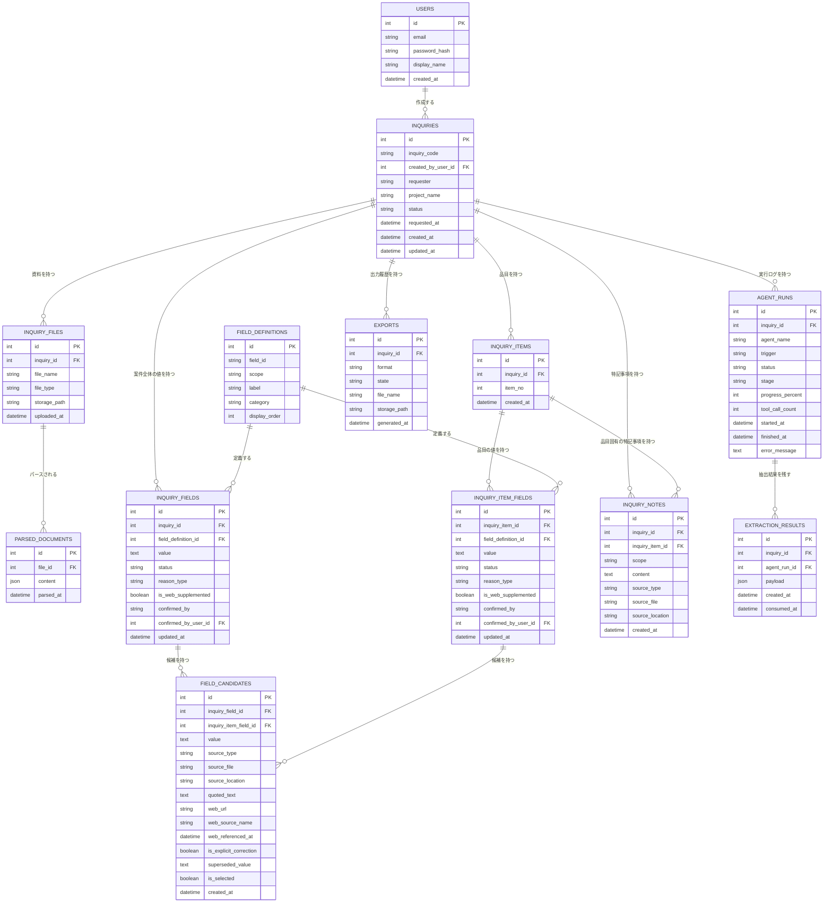

# DB設計書（詳細設計）: 引合書整理エージェント

> Vモデル: 詳細設計 / 対応する検証: 単体テスト
> 機能（02-requirement.mdのFUNC-xx）・画面（03-spec.mdのSCR-xx）・エージェント（agent-plan.mdのAGENT-01/AGENT-02）が扱うデータを、テーブル設計に落とし込む。
>
> `07-infra.md` は未作成のため、自前ホスティング（ローカル・単一ユーザーPoC、DBエンジン未確定）を前提に論理設計する。DBエンジン固有の型（PostgreSQLのJSONB/配列、MySQLのJSON/ENUM等）の最終選定はBuildフェーズで行い、本書では汎用的な型・CHECK制約として記述する。ファイル実体はDBに持たず、`inquiry_files.storage_path`にパス／URLのみを保持する（S3等の外部ストレージ導入時もこの構造のまま対応可能）。

## 1. テーブル一覧

| テーブル名 | 目的 | 関連機能(②) |
|-----------|------|-------------|
| `users` | ログインユーザー（PoCでは単一ユーザーを想定した簡易アカウント） | 非機能要件（4章・認証はMVPでは簡易実装）、SCR-00 |
| `inquiries` | 引合（案件）本体。状態（確認中／確定済み）を含むヘッダー情報 | FUNC-01, FUNC-03, FUNC-09、SCR-01, SCR-03 |
| `inquiry_files` | 引合にアップロードされた資料ファイル（xlsx/pdf/eml） | FUNC-01、SCR-02, SCR-05 |
| `parsed_documents` | AGENT-01がファイルをパースした中間テキスト（ページ/シート/セクション単位） | FUNC-02、agent-plan.md AGENT-01ツール一覧 |
| `field_definitions` | 固定項目マスタ（A項目14／B項目8、Bootcamp必須項目／補助項目の区分を含む） | FUNC-02 |
| `inquiry_items` | 品目（B項目を保持する行）の単位 | FUNC-02、SCR-03品目一覧 |
| `inquiry_fields` | 引合・案件全体（A項目）の値・状態・確認理由 | FUNC-02, FUNC-03, FUNC-07、SCR-03案件サマリー、SCR-04 |
| `inquiry_item_fields` | 品目ごと（B項目）の値・状態・確認理由 | FUNC-02, FUNC-03, FUNC-07、SCR-03品目一覧、SCR-04 |
| `field_candidates` | 各項目（A/B）の候補値・出典（資料形式別ロケーション、Web参照元、明示的訂正の手がかり） | FUNC-02, FUNC-03, FUNC-04, FUNC-06、SCR-04 |
| `inquiry_notes` | その他特記事項（案件全体／品目固有、出典付き） | FUNC-02、SCR-03その他特記事項 |
| `exports` | 出力（成果物）履歴。`_draft`/`_final`の判別に対応 | FUNC-05, FUNC-09、SCR-03出力形式選択モーダル |
| `agent_runs` | AGENT-01/AGENT-02の実行ログ（完了条件・強制停止しきい値の判定に使用） | agent-plan.md 完了条件・停止条件、非機能要件（性能） |
| `extraction_results` | AGENT-01の出力（ExtractionResult）をAGENT-02が参照するための一時保存 | agent-plan.md「AGENT-01→AGENT-02引き渡しスキーマ」 |

> `agent-plan.md`未確定事項2「`field_status_rules`・`extraction_candidates`の命名整合」への回答: `field_status_rules`はデータとして持たず、`inquiry_fields.status`/`reason_type`のCHECK制約（列挙値）として実装する（値の種類が固定・少数で、コードとしての定義で十分なため）。`extraction_candidates`は本書で`extraction_results`として定義する。

## 2. ER図

## 3. テーブル定義

### users

**目的**: ログイン画面（SCR-00）で使用する簡易アカウント。非機能要件「セキュリティ」の方針どおり、本番相当の認証基盤（セッション管理・SSO等）はMVP対象外のため、最小限のメールアドレス／パスワードのみを保持する。`inquiry_fields`/`inquiry_item_fields`の`confirmed_by_user_id`から参照され、将来のマルチユーザー化・監査ログ機能（Scope 2「修正履歴・監査ログの詳細表示」）の土台とする。

| カラム | 型 | 制約 | 説明 |
|-------|-----|------|------|
| id | integer | PK, AUTO_INCREMENT | 主キー |
| email | varchar(255) | NOT NULL, UNIQUE | ログインID（メールアドレス） |
| password_hash | varchar(255) | NOT NULL | パスワードのハッシュ値（PoC簡易実装。本番導入時は認証サービス連携に置き換える想定） |
| display_name | varchar(100) | NOT NULL | 画面表示名（例: 田中 太郎） |
| created_at | datetime | DEFAULT CURRENT_TIMESTAMP | 作成日時 |

### inquiries

**目的**: 引合（案件）のヘッダー情報。SCR-01の一覧表示・SCR-03のページヘッダーで参照される。`requester`/`project_name`はA項目の一部でもあるが（`inquiry_fields`にも同じ内容が入る）、一覧画面での高速表示のために本テーブルへ非正規化して保持する（3章末尾「正規化の検討」参照）。

| カラム | 型 | 制約 | 説明 |
|-------|-----|------|------|
| id | integer | PK, AUTO_INCREMENT | 主キー |
| inquiry_code | varchar(30) | NOT NULL, UNIQUE | 表示用引合ID（例: `INQ-2026-0091`） |
| created_by_user_id | integer | FK → users.id, NULL可 | 作成した担当者（PoCでは常に単一ユーザー） |
| requester | varchar(255) | NULL可 | 依頼元企業（A項目「依頼元企業」の非正規化キャッシュ） |
| project_name | varchar(255) | NULL可 | 案件名／プロジェクト名（A項目の非正規化キャッシュ） |
| status | varchar(20) | NOT NULL, CHECK (`draft`, `final`), DEFAULT `draft` | 内部ステータス。画面表示は「確認中」（`draft`）／「確定済み」（`final`）（FUNC-03） |
| requested_at | datetime | NULL可 | 依頼日時（A項目「引合日」由来。資料から抽出できるまではNULL） |
| created_at | datetime | DEFAULT CURRENT_TIMESTAMP | 引合作成日時（=最初のアップロード日時） |
| updated_at | datetime | ON UPDATE CURRENT_TIMESTAMP | 最終更新日時（SCR-01一覧の「最終更新」列） |

### inquiry_files

**目的**: FUNC-01でアップロードされた資料ファイルのメタデータ。ファイル実体は保持せず、保存先パス／URLのみを持つ。

| カラム | 型 | 制約 | 説明 |
|-------|-----|------|------|
| id | integer | PK, AUTO_INCREMENT | 主キー |
| inquiry_id | integer | FK → inquiries.id, NOT NULL | 紐づく引合 |
| file_name | varchar(255) | NOT NULL | 元のファイル名 |
| file_type | varchar(10) | NOT NULL, CHECK (`xlsx`, `pdf`, `eml`) | 対応形式（FUNC-01例外・バリデーション） |
| storage_path | varchar(500) | NOT NULL | ファイル実体の保存先（ローカルパス／将来的なオブジェクトストレージURL） |
| uploaded_at | datetime | DEFAULT CURRENT_TIMESTAMP | アップロード日時（新規アップロード・資料追加のいずれも記録） |

### parsed_documents

**目的**: AGENT-01（`parse_excel`/`parse_pdf`/`parse_eml`ツール）がファイルをパースした中間テキストを保持する。ページ番号・シート名+セル位置・メールのセクション等、資料形式に応じたロケーション情報を`content`に構造化して格納する。

| カラム | 型 | 制約 | 説明 |
|-------|-----|------|------|
| id | integer | PK, AUTO_INCREMENT | 主キー |
| file_id | integer | FK → inquiry_files.id, NOT NULL | パース元ファイル |
| content | json | NOT NULL | 形式別の構造化テキスト（例: `[{page:1, text:"..."}]`／`[{sheet:"シート2", cell:"D5", text:"..."}]`／`[{section:"本文3段落目", text:"..."}]`） |
| parsed_at | datetime | DEFAULT CURRENT_TIMESTAMP | パース実行日時 |

### field_definitions

**目的**: 02-requirement.md FUNC-02で定義された固定項目マスタ。A項目（`scope='case'`）14件・B項目（`scope='item'`）8件を初期データとして持つ。「その他特記事項／その他条件」（拡張項目）はここには含めず、`inquiry_notes`で扱う（FUNC-02「その他の扱い」）。

| カラム | 型 | 制約 | 説明 |
|-------|-----|------|------|
| id | integer | PK, AUTO_INCREMENT | 主キー |
| field_id | varchar(50) | NOT NULL, UNIQUE | 項目コード（例: `requester`, `engineering_company`, `grade`） |
| scope | varchar(10) | NOT NULL, CHECK (`case`, `item`) | A項目（`case`）／B項目（`item`）の区分 |
| label | varchar(100) | NOT NULL | 画面表示ラベル（例: `engineering_company`→「エンジニアリング会社」。03-spec.md「UI表示ラベルの補足」に対応） |
| category | varchar(20) | NOT NULL, CHECK (`bootcamp_required`, `auxiliary`) | Bootcamp必須項目／補助項目の区分（FUNC-02） |
| display_order | integer | NOT NULL | 画面表示順（案件サマリー・品目一覧の列順） |

### inquiry_items

**目的**: 品目（B項目のまとまり）の単位。1引合に複数品目が存在しうる（SCR-03品目一覧の行）。

| カラム | 型 | 制約 | 説明 |
|-------|-----|------|------|
| id | integer | PK, AUTO_INCREMENT | 主キー |
| inquiry_id | integer | FK → inquiries.id, NOT NULL | 紐づく引合 |
| item_no | integer | NOT NULL | 品目番号（画面表示の「#」列、引合内で連番） |
| created_at | datetime | DEFAULT CURRENT_TIMESTAMP | 作成日時 |

> 制約: `UNIQUE (inquiry_id, item_no)`

### inquiry_fields

**目的**: A項目（案件全体）の現在値と状態を保持する。SCR-03案件サマリー・SCR-04 Inspectorの表示元。1引合につき`field_definitions`（`scope='case'`）と同数（14件）の行を持つ。

| カラム | 型 | 制約 | 説明 |
|-------|-----|------|------|
| id | integer | PK, AUTO_INCREMENT | 主キー |
| inquiry_id | integer | FK → inquiries.id, NOT NULL | 紐づく引合 |
| field_definition_id | integer | FK → field_definitions.id, NOT NULL | 対象の固定項目（`scope='case'`のもの） |
| value | text | NULL可 | 現在の確定値（要確認〔`review`〕で候補が0件の場合はNULL） |
| status | varchar(10) | NOT NULL, CHECK (`ok`, `review`), DEFAULT `review` | ユーザー向けステータス（03-spec.md「4. ステータス表現」）。`ok`＝確認不要、`review`＝要確認 |
| reason_type | varchar(20) | NULL可, CHECK (`missing`, `conflict`, `ambiguous`, `multiple_candidates`, `parse_error`) | `status='review'`のときのみ必須。要確認理由（内部enum、Inspector内で日本語表示に変換） |
| is_web_supplemented | boolean | NOT NULL, DEFAULT false | Web検索により値・候補を得たか（`status`とは独立した由来属性。FUNC-04「Web補完の採用条件」） |
| confirmed_by | varchar(10) | NULL可, CHECK (`ai`, `web`, `user`) | 現在値を確定した主体。`status='ok'`のときのみ設定（FUNC-08「AI抽出値／Web補完値／担当者修正値の区別」） |
| confirmed_by_user_id | integer | FK → users.id, NULL可 | `confirmed_by='user'`のときの確定担当者 |
| updated_at | datetime | ON UPDATE CURRENT_TIMESTAMP | 最終更新日時 |

> 制約: `UNIQUE (inquiry_id, field_definition_id)`。`status='review'`のとき`reason_type`はNOT NULL、`status='ok'`のとき`reason_type`はNULLとするCHECK制約を設ける。

### inquiry_item_fields

**目的**: B項目（品目ごと）の現在値と状態を保持する。構造・制約は`inquiry_fields`と対称（対象が引合単位か品目単位かの違いのみ）。

| カラム | 型 | 制約 | 説明 |
|-------|-----|------|------|
| id | integer | PK, AUTO_INCREMENT | 主キー |
| inquiry_item_id | integer | FK → inquiry_items.id, NOT NULL | 紐づく品目 |
| field_definition_id | integer | FK → field_definitions.id, NOT NULL | 対象の固定項目（`scope='item'`のもの） |
| value | text | NULL可 | 現在の確定値 |
| status | varchar(10) | NOT NULL, CHECK (`ok`, `review`), DEFAULT `review` | ユーザー向けステータス |
| reason_type | varchar(20) | NULL可, CHECK (`missing`, `conflict`, `ambiguous`, `multiple_candidates`, `parse_error`) | `status='review'`のときのみ必須 |
| is_web_supplemented | boolean | NOT NULL, DEFAULT false | Web補完の由来フラグ |
| confirmed_by | varchar(10) | NULL可, CHECK (`ai`, `web`, `user`) | 現在値の確定主体 |
| confirmed_by_user_id | integer | FK → users.id, NULL可 | `confirmed_by='user'`のときの確定担当者 |
| updated_at | datetime | ON UPDATE CURRENT_TIMESTAMP | 最終更新日時 |

> 制約: `UNIQUE (inquiry_item_id, field_definition_id)`。`status`/`reason_type`のCHECK制約は`inquiry_fields`と同様。

### field_candidates

**目的**: A項目・B項目それぞれの候補値と出典を保持する（Inspectorの「候補値リスト」「出典プレビュー」の表示元、AGENT-02の`compare_and_merge_candidates`/`evaluate_explicit_correction`の入出力）。`inquiry_field_id`（A項目向け）と`inquiry_item_field_id`（B項目向け）のどちらか一方のみを設定する。

| カラム | 型 | 制約 | 説明 |
|-------|-----|------|------|
| id | integer | PK, AUTO_INCREMENT | 主キー |
| inquiry_field_id | integer | FK → inquiry_fields.id, NULL可 | A項目の場合に設定 |
| inquiry_item_field_id | integer | FK → inquiry_item_fields.id, NULL可 | B項目の場合に設定 |
| value | text | NOT NULL | 候補値 |
| source_type | varchar(10) | NOT NULL, CHECK (`pdf`, `excel`, `eml`, `web`) | 出典の資料形式（FUNC-06） |
| source_file | varchar(255) | NULL可 | 出典ファイル名（`source_type='web'`の場合はNULL） |
| source_location | varchar(255) | NULL可 | ページ番号／シート名+セル位置／該当箇所（FUNC-06「出典情報の保持内容」） |
| quoted_text | text | NULL可 | 出典箇所の引用テキスト（Inspectorのハイライト表示元） |
| web_url | varchar(500) | NULL可 | `source_type='web'`のときの参照元URL（FUNC-04） |
| web_source_name | varchar(255) | NULL可 | Web参照元名称 |
| web_referenced_at | datetime | NULL可 | Web参照日時 |
| is_explicit_correction | boolean | NOT NULL, DEFAULT false | 明示的な訂正・変更表現に基づく候補か（FUNC-02例外・バリデーション。例: 「先ほどの数量240本ではなく320本で」） |
| superseded_value | text | NULL可 | 訂正前とみられる値（読み取れた場合のみ） |
| is_selected | boolean | NOT NULL, DEFAULT false | 現在の確定値として採用されている候補か（`inquiry_fields.value`/`inquiry_item_fields.value`と対応する候補にtrueを立てる。SCR-04根拠確認モードで表示する1件の判定に使用） |
| created_at | datetime | DEFAULT CURRENT_TIMESTAMP | 抽出・取得日時 |

> 制約: `CHECK ((inquiry_field_id IS NOT NULL AND inquiry_item_field_id IS NULL) OR (inquiry_field_id IS NULL AND inquiry_item_field_id IS NOT NULL))`

### inquiry_notes

**目的**: 固定項目に当てはまらない「その他特記事項」（案件全体）／「その他条件」（品目固有）を保持する（FUNC-02「その他の扱い」）。1件の自由記述ではなく、`{項目内容, 出典}`の組を複数行として保持する。

| カラム | 型 | 制約 | 説明 |
|-------|-----|------|------|
| id | integer | PK, AUTO_INCREMENT | 主キー |
| inquiry_id | integer | FK → inquiries.id, NOT NULL | 紐づく引合 |
| inquiry_item_id | integer | FK → inquiry_items.id, NULL可 | 品目固有の特記事項の場合に設定（案件全体の場合はNULL） |
| scope | varchar(10) | NOT NULL, CHECK (`case`, `item`) | 「案件全体」／「品目固有」のタブ切替に対応（`inquiry_item_id`の設定有無と一致させる） |
| content | text | NOT NULL | 特記事項の内容（例: 「Mill Certificate提出必須」） |
| source_type | varchar(10) | NULL可, CHECK (`pdf`, `excel`, `eml`, `web`) | 出典の資料形式 |
| source_file | varchar(255) | NULL可 | 出典ファイル名 |
| source_location | varchar(255) | NULL可 | 出典箇所（例: `p.2`, `本文`） |
| created_at | datetime | DEFAULT CURRENT_TIMESTAMP | 抽出日時 |

> 制約: `scope='item'`のとき`inquiry_item_id`はNOT NULL、`scope='case'`のとき`inquiry_item_id`はNULLとするCHECK制約を設ける。

### exports

**目的**: FUNC-05/FUNC-09の成果物出力履歴。ファイル名から`_draft`/`_final`が判別できることの根拠データ。SCR-03の出力形式選択モーダルからの出力操作ごとに1行追加する。

| カラム | 型 | 制約 | 説明 |
|-------|-----|------|------|
| id | integer | PK, AUTO_INCREMENT | 主キー |
| inquiry_id | integer | FK → inquiries.id, NOT NULL | 対象引合 |
| format | varchar(10) | NOT NULL, CHECK (`excel`, `word`, `pdf`) | 出力形式。Scope 1で有効なのは`excel`のみ（`word`/`pdf`はScope 2、選択肢としては保持） |
| state | varchar(10) | NOT NULL, CHECK (`draft`, `final`) | 出力時点の`inquiries.status`のスナップショット |
| file_name | varchar(255) | NOT NULL | 生成されたファイル名（例: `INQ-2026-0091_final.xlsx`） |
| storage_path | varchar(500) | NOT NULL | 生成ファイルの保存先 |
| generated_at | datetime | DEFAULT CURRENT_TIMESTAMP | 出力日時 |

### agent_runs

**目的**: AGENT-01/AGENT-02の実行ログ。agent-plan.mdの完了条件・強制停止（ツール呼び出し数・タイムアウト）の判定材料であり、Tips「エージェントの実行状態は見落としやすい」に対応する。

| カラム | 型 | 制約 | 説明 |
|-------|-----|------|------|
| id | integer | PK, AUTO_INCREMENT | 主キー |
| inquiry_id | integer | FK → inquiries.id, NOT NULL | 対象引合 |
| agent_name | varchar(30) | NOT NULL, CHECK (`agent01_extraction`, `agent02_verification`) | 実行したエージェント |
| trigger | varchar(20) | NOT NULL, CHECK (`new_upload`, `additional_upload`) | 起動要因（SCR-02の新規アップロード／SCR-05の資料追加） |
| status | varchar(20) | NOT NULL, CHECK (`running`, `succeeded`, `failed`, `stopped`), DEFAULT `running` | 実行状態。`stopped`は強制停止であり`failed`（通常失敗）とは区別する（agent-plan.md「強制停止・停止条件」） |
| stage | varchar(20) | NOT NULL, CHECK (`uploading`, `extracting`, `structuring`, `reviewing`, `completed`, `failed`, `stopped`), DEFAULT `uploading` | `GET /inquiries/{id}/agent-status`（05-api-ipo.md）が返す進捗表示用の詳細段階。更新契機・目安progress_percentはagent-plan.md「stage / progress_percent の更新方針」を参照 |
| progress_percent | integer | NOT NULL, CHECK (0〜100), DEFAULT 0 | 進捗率（0〜100の整数）。`failed`/`stopped`遷移時は直近の値を維持し0に巻き戻さない |
| tool_call_count | integer | NOT NULL, DEFAULT 0 | ツール呼び出し回数（強制停止しきい値の判定に使用。AGENT-01は15回、AGENT-02は15回が暫定値〔仮説〕） |
| started_at | datetime | DEFAULT CURRENT_TIMESTAMP | 実行開始日時（タイムアウト判定の起点） |
| finished_at | datetime | NULL可 | 実行終了日時 |
| error_message | text | NULL可 | 失敗・強制停止時のエラー内容（`stopped`の場合は「一部項目の処理が途中で停止しました」等、部分的な結果が保存されている旨を含める） |

### extraction_results

**目的**: AGENT-01の出力（ExtractionResult）を一時的に保存し、AGENT-02が参照する（agent-plan.md「AGENT-01→AGENT-02引き渡しスキーマ」）。AGENT-01は本テーブルへの書き込みのみ行い、`inquiry_fields`等の正本テーブルへは書き込まない（AGENT-01のガードレール「status判定はAGENT-02の責務」）。

| カラム | 型 | 制約 | 説明 |
|-------|-----|------|------|
| id | integer | PK, AUTO_INCREMENT | 主キー |
| inquiry_id | integer | FK → inquiries.id, NOT NULL | 対象引合 |
| agent_run_id | integer | FK → agent_runs.id, NOT NULL | 生成元のAGENT-01実行ログ |
| payload | json | NOT NULL | ExtractionResult全体（`case_fields`/`item_fields`/`case_notes`/`item_notes`、候補ごとに`field_id`/`value`/`source_type`/`source_file`/`source_location`/`quoted_text`/`correction_hint`を含む） |
| created_at | datetime | DEFAULT CURRENT_TIMESTAMP | AGENT-01の出力日時 |
| consumed_at | datetime | NULL可 | AGENT-02が読み取り、`inquiry_fields`等へ変換・保存を完了した日時（NULLは未処理） |

> 実際に動く CREATE 文（DDL）は Build フェーズの成果物として `db/schema.sql` などに作成する。
> この設計書ではテーブル定義表・ER図・制約までを正とする。

## 4. 正規化の検討

- **`inquiries.requester`/`inquiries.project_name`は意図的な非正規化。** 本来はA項目として`inquiry_fields`（`field_definitions.field_id = 'requester' / 'project_name'`）にのみ持たせば正規化上は十分だが、SCR-01（進捗確認一覧）が引合ごとに依頼元企業・案件名を毎回JOINして取得するのは行数が増えた際のコストになるため、`inquiries`にキャッシュ列として複製する。書き込みは「`inquiry_fields`が確定したタイミングで`inquiries`側も同期する」という一方向の同期ルールとし、正本はあくまで`inquiry_fields`とする。
- **SCR-01の「要確認件数」は非正規化しない。** `inquiry_fields`/`inquiry_item_fields`の`status='review'`件数を都度集計するクエリで取得する方針とする（PoC規模のデータ量では集計コストが小さく、キャッシュ列を追加して同期漏れのリスクを負うより単純な実装を優先する）。データ量が増えた場合は`inquiries.review_count`のような集計列の追加を将来検討する。
- **「構造化JSON（Single Source of Truth）」（FUNC-03）は、本設計では正規化されたテーブル群（`inquiry_fields`/`inquiry_item_fields`/`field_candidates`/`inquiry_notes`）そのものを正本として扱う。** FUNC-06（根拠提示）・FUNC-07（要確認検知）・FUNC-08（修正）がいずれも項目単位でのステータス・候補・出典の参照/更新を必要とするため、JSON列1本にまとめるより正規化した方が実装・整合性の両面で有利と判断した。API層（05-api-ipo）で、これらのテーブルをJOINして「構造化JSON」相当のレスポンス（および成果物Excel生成の入力）を組み立てる設計とする。
- **`field_candidates`をA項目・B項目で1テーブルに共通化した。** 候補値・出典のスキーマ（`source_type`/`source_location`/`quoted_text`等）がA/B項目で完全に同一であるため、`inquiry_field_id`と`inquiry_item_field_id`をどちらか一方のみ設定できる形で共通化し、テーブルの重複を避けた。
- **`extraction_results.payload`のみJSON型を許容している。** AGENT-01→AGENT-02間の一時的な受け渡しデータであり、UI・他機能から直接クエリされることがないため、正規化のコストに見合わない。AGENT-02が読み取った後は`inquiry_fields`等の正規化テーブルへ変換して保存する。

## 5. 追加アップロード時のデータ更新ルール（既存カラムでの実現方法）

agent-plan.md「4. AGENT-02」の「追加アップロード時にユーザー確定済みの値を自動上書きしないルール」を、新しいカラムを追加せず既存のテーブル構造で以下のように実現する。

1. 既存項目が`inquiry_fields.confirmed_by = 'user'`（または`inquiry_item_fields.confirmed_by = 'user'`）の場合、`value`はAGENT-02からは変更しない。
2. 追加資料から得られた新しい候補は、`field_candidates`に新規行として追加する（`is_selected = false`）。既存の確定候補（`is_selected = true`）はそのまま残す。
3. 新候補の値が既存の`value`と完全一致する場合のみ、`status = 'ok'`のまま変化しない（新候補行は追加されるが`is_selected`は既存のまま）。
4. 新候補の値が既存の`value`と異なる場合、`status`を`'review'`、`reason_type`を`'conflict'`に更新する（`value`と`confirmed_by`はそのまま`'user'`を維持し、「確定後に異なる情報が検出された」状態を表す）。
5. 上記4の状態は、担当者がSCR-04で改めて値を確定する（FUNC-08、`PATCH /inquiries/{id}/fields/{field_id}` 等）まで維持される。AGENT-02が自動的に`status`を`'ok'`へ戻すことはない。

この結果、Inspector（SCR-04 確認・修正モード）は`field_candidates`から`is_selected = true`の既存候補と新規候補の両方を出典付きで取得でき、担当者は両者を比較したうえで再確定できる。

---

## 次のステップ

→ `05-api-ipo`（API・IPO一覧・詳細設計）でフローごとのIPOとAPI一覧を作成する
→ 必要に応じて `02-requirement.md` の各機能に「対応テーブル」欄を追記更新する
