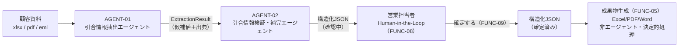

# エージェント設計: 引合書整理エージェント

> Vモデル: 基本設計〜詳細設計を貫く縦串 / 対応する検証: エージェント評価（⑥ シナリオテストに反映）
> エージェントは「インプット → ループ（判断 → ツール実行 → 観察）→ 完了条件の充足」で動く。
> **完了条件は評価の合格基準そのもの。** 設計時に「終わりの定義」を書けないエージェントは実装できない。

## 1. エージェント一覧

| # | エージェント | ミッション | 起動トリガー | 対応機能(②) |
|---|------------|------|------------|------------|
| 1 | AGENT-01 引合情報抽出エージェント | Excel／PDF／EML等の顧客資料を読み込み、02-requirement.mdで定義された固定項目について、候補値と出典を事実ベースで抽出する。複数候補の正誤判断・矛盾解消・Web補完・確定は行わない | 新規アップロード完了（SCR-02）／既存引合への資料追加完了（SCR-05） | FUNC-01（トリガー）, FUNC-02, FUNC-06（出典情報の起点） |
| 2 | AGENT-02 引合情報検証・補完エージェント | AGENT-01が抽出した候補値を複数資料横断で検証し、値の統合・矛盾検知・明示的訂正の評価・限定的なWeb補完を行い、担当者が「怪しい箇所だけ確認すればよい」状態の構造化JSON（確認中）を生成する | AGENT-01の完了（ExtractionResultの生成） | FUNC-03, FUNC-04, FUNC-06（出典の集約・提示）, FUNC-07 |

> FUNC-05（成果物生成）・FUNC-08（担当者による確認・修正）・FUNC-09（成果物確定）は、いずれのエージェントのループにも含めない。FUNC-08／FUNC-09は人間主導の決定的なCRUD操作、FUNC-05は確定後にJSONから成果物を生成する決定的処理であり、判断分岐を持たないためエージェント化しない（詳細は「5. 非エージェント処理」）。2体構成とした理由は「6. 設計の妥当性（自己レビュー）」を参照。

---

## 2. エージェント間データフロー



### AGENT-01 → AGENT-02 引き渡しスキーマ（ExtractionResult）

AGENT-01はステータス判定（missing/conflict等）を行わない。項目ごとに「見つかった候補の配列（0件も可）」のみを返し、統合・判定はAGENT-02が行う。

```
ExtractionCandidate {
  field_id: string          // 固定項目ID。「4. 用語・固定項目の統一」の一覧に準拠
  value: string | null
  source_type: "pdf" | "excel" | "eml"
  source_file: string       // ファイル名
  source_location: string   // pdf: ページ番号 / excel: シート名+セル位置 / eml: 該当箇所（件名／本文段落等）
  quoted_text: string       // 出典箇所の引用テキスト（該当抜粋）
  correction_hint?: {       // 資料内に明示的な訂正・変更表現があった場合のみ付与（AGENT-01は判断せず材料として保持）
    is_explicit_correction: boolean   // 「先ほどの数量240本ではなく320本で」等、変更の意図が文面から読み取れるか
    superseded_value?: string         // 訂正前とみられる値（読み取れた場合）
  }
}

ExtractionResult {
  inquiry_id: string
  source_files: string[]
  case_fields: { [field_id: string]: ExtractionCandidate[] }                 // A: 引合・案件全体の固定項目（14）
  item_fields: { [item_index: number]: { [field_id: string]: ExtractionCandidate[] } }  // B: 品目ごとの固定項目（8×品目数）
  case_notes: ExtractionCandidate[]                                          // 案件全体のその他特記事項（拡張項目）
  item_notes: { [item_index: number]: ExtractionCandidate[] }                // 品目固有のその他条件（拡張項目）
}
```

少なくとも `field_id / value / source_type / source_file / source_location / quoted_text` を各候補について追跡できる形とし、AGENT-02はこのExtractionResultのみを入力として受け取る（パース前の生テキスト全文は再度渡さず、必要な範囲はquoted_textとして既に含まれている前提でコンテキストを節約する）。

### stage / progress_percent の更新方針（SCR-02進捗表示・05-api-ipo.md `GET /inquiries/{id}/agent-status` 用）

AGENT-01・AGENT-02それぞれの実行は `agent_runs` テーブル（04-db.md）に1行ずつ記録される。フロントエンドが参照する `GET /inquiries/{id}/agent-status`（05-api-ipo.md）は、対象引合の`agent_runs`のうち最も新しい（`started_at`が最新の）行の`stage`・`progress_percent`・`status`・`error_message`をそのまま返す。1回のアップロード処理でAGENT-01→AGENT-02の順に2行が作成されるため、AGENT-01完了直後・AGENT-02起動前の一瞬を除き、常にどちらか一方の実行中の行が「最新」として参照される。

`stage`はAGENT-01/AGENT-02のIPOステップの進行に応じて以下の目安で更新する（**PoC用暫定値【仮説】。実測を踏まえて変更可能**）。

| stage | 意味 | 担当エージェント | progress_percent目安【仮説】 | 更新の契機 |
|-------|------|------------------|------------------------------|-----------|
| `uploading` | ファイル保存中 | - | 0〜20% | `POST /inquiries`／`POST /inquiries/{id}/files`受付時に`agent_runs`（AGENT-01分）をstatus=running・stage=uploading・progress_percent=0で作成し、ファイル保存完了時点で20%に更新する |
| `extracting` | AGENT-01が資料をパース・固定項目を抽出中 | AGENT-01 | 20〜55% | IPOステップ1（parse_excel/parse_pdf/parse_eml）開始で20%、ステップ2〜4（extract_case_fields/extract_item_fields/extract_supplementary_notes）の進行に応じて35%・45%程度まで進め、ステップ5（emit_extraction_result）完了・status=succeededで55%に達する |
| `structuring` | AGENT-02が候補の統合・矛盾検知・訂正評価・ステータス判定を実行中 | AGENT-02 | 55〜80% | AGENT-01のstatus=succeededを検知してAGENT-02の`agent_runs`行を新規作成しstage=structuring・progress_percent=55で開始。IPOステップ1〜4（load_existing_inquiry〜classify_status）の完了に応じて80%まで進める |
| `reviewing` | AGENT-02がWeb補完候補の取得・採否判定・要確認項目の整理を実行中 | AGENT-02 | 80〜99% | IPOステップ5（web_search_company_info、対象項目がない場合は即時通過）で80%から開始し、判定完了で99%まで進める |
| `completed` | 構造化JSON（確認中状態）の保存が完了 | AGENT-02 | 100% | IPOステップ6（save_structured_result）の完了条件チェック合格・保存成功でstatus=succeeded・progress_percent=100に更新する |
| `failed` | 完了条件（失敗）に該当し中断 | AGENT-01 または AGENT-02 | 失敗検知時点の直近の値を維持（巻き戻さない） | 各エージェントの「完了条件・停止条件」表の失敗（中断）条件に該当した時点でstatus=failed・stage=failedに更新し、`error_message`に担当者向けの理由を設定する |
| `stopped` | 強制停止（ツール呼び出し数上限／タイムアウト）に該当し中断 | AGENT-01 または AGENT-02 | 強制停止時点の直近の値を維持（巻き戻さない） | 各エージェントの「完了条件・停止条件」表の強制停止条件に該当した時点でstatus=stopped・stage=stoppedに更新する。`failed`とは明確に区別し、`error_message`には「一部項目の処理が途中で停止しました」等、部分的な結果が保存されている旨を設定する |

`stopped`は`failed`と異なり、その時点までに処理できた項目を反映した部分的な結果（AGENT-01: 「抽出未完了」フラグ付きExtractionResult、AGENT-02: 未処理項目をstatus=要確認〔理由: parse_error相当〕として保存した構造化JSON）が既に保存されていることを前提とする（各エージェントの「完了条件・停止条件」参照）。

---

## 3. AGENT-01 引合情報抽出エージェント

### Part 1: エージェントの定義（基本設計）

> プロダクト定義レビュー（`/design-product-check`）の対象。

#### ミッション

Excel／PDF／EML等の顧客資料を読み込み、02-requirement.md FUNC-02で定義された固定項目（A: 引合・案件全体情報14項目、B: 品目ごとの情報8項目×品目、両階層の拡張項目「その他特記事項／その他条件」）について、候補値と出典を事実ベースで抽出する。複数候補のどちらが正しいかの最終判断、資料間矛盾の解消、Web検索による補完、Human-in-the-Loop、最終確定、成果物生成は行わない。

**対応機能(②)**: FUNC-01（トリガー）, FUNC-02, FUNC-06（出典情報の起点）

#### インプット

| 項目 | 内容 |
|------|------|
| 起動トリガー | ユーザー操作。①SCR-02で1件以上のファイル（xlsx/pdf/eml混在可）のアップロードが完了したとき（新規引合）。②SCR-05で既存引合に「資料を追加」操作が行われたとき（追加アップロード） |
| 入力データ | 今回アップロードされたファイル本体一式（新規時は全件、追加時は今回追加された差分ファイルのみ）、固定項目スキーマ定義（02-requirement.md FUNC-02のA14項目＋B8項目＋両階層の拡張項目） |
| コンテキスト方針 | 渡すもの: 今回アップロードされたファイルの内容、固定項目スキーマ。<br>渡さないもの: 他の引合（他案件）のデータ、既存の構造化JSON（既存データとの統合・矛盾判断はAGENT-02の責務であり、AGENT-01には不要）、Web検索結果（AGENT-01はWeb検索ツールを持たない） |

#### 完了条件・停止条件

| 種別 | 条件 | 判定方法 |
|------|------|---------|
| 成功（完了） | 今回アップロードされた全ファイルがパースされ、固定項目キー（A14＋B8×品目＋拡張項目2種）の全てについて、資料中に記載があった項目は「候補値＋出典（field_id/value/source_type/source_file/source_location/quoted_text）」の組が1件以上、記載が見つからなかった項目は空の候補配列を持つExtractionResultが1件生成されている | 出力直前にExtractionResultをスキーマ検証し、(a) source_filesに今回アップロードされた全ファイルが含まれる、(b) case_fields／item_fieldsのキーとしてA14＋B8の固定項目IDが全て存在する（候補が空配列でもキー自体は必須）、(c) 候補が1件以上ある項目は各候補にfield_id/value/source_type/source_file/source_location/quoted_textが揃っている、の3点を自動チェックし全て合格すること |
| 失敗（中断） | 今回アップロードされた全ファイルが対応形式（xlsx/pdf/eml）としてパースできなかった場合 | parse_excel／parse_pdf／parse_emlの成功件数が0件であることを検知した時点で失敗と判定し、ExtractionResultを生成・保存せず担当者へエラー通知する（AGENT-02は起動しない） |
| 強制停止【実測に基づき調整済み。Build段階の実測値】 | 最大ツール呼び出し数15回、またはタイムアウト180秒（1引合・1回の抽出処理あたり）。無応答（ハング）検知は45秒 | エージェント実行ループでツール呼び出しごとにカウンタをインクリメントし上限到達で強制終了。あわせて実行開始時刻からの経過時間・メッセージ間無応答時間を監視し閾値超過でも強制終了。いずれの場合も、その時点までに抽出できた項目のみを反映した部分的なExtractionResultを「抽出未完了」フラグ付きで保存し、担当者・運用ログに検知可能な形で残す（実測メモ: sample-01.xlsx・128セルの実データで、parse_excel後の14+8項目候補抽出の検討に要する単一ターンの思考時間が旧値20秒を超えinactivity_timeoutが発火したため、無応答45秒・全体180秒に引き上げた） |

**出力形式**: 「2. エージェント間データフロー」で定義したExtractionResult（引合単位）。保存先はAGENT-02が参照する一時テーブル `extraction_results`（04-db.mdで設計）。パース済みの中間テキストも `parsed_documents` に保存する。

#### ユーザーから見た体験

- **実行中の見え方**: SCR-02のアップロード画面下部の進捗表示のうち、「アップロード中 → AI解析中」の段階に相当する（03-spec SCR-02参照）。AGENT-01単体の完了はユーザーには個別に可視化せず、AGENT-02までの完了を一体的な進捗として見せる。
- **中間承認**: なし。
- **対応画面(③)**: SCR-02（起動）。抽出結果（ExtractionResult）そのものを担当者が直接見る画面はなく、AGENT-02が生成した構造化JSONがSCR-03／SCR-04に表示される。

### Part 2: エージェントの実現（詳細設計）

> 実装設計レビュー（`/design-implementation-check`）の対象。

#### ツール一覧

| ツール名 | 目的 | 入力 | 出力 | 副作用 | 必要なAPI/テーブル(→④⑤) |
|---------|------|------|------|--------|------------------------|
| parse_excel | Excelファイルの表構造（シート・セル・結合セル・複数行見出し等）をテキスト化する | file_id | シート単位の行・列データ（セル座標付き） | read | inquiry_files, parsed_documents |
| parse_pdf | PDFの本文をページ単位でテキスト化する | file_id | ページ単位テキスト（ページ番号付き） | read | inquiry_files, parsed_documents |
| parse_eml | メールの件名・本文をセクション単位でテキスト化する（本文中の追記・訂正箇所を含む） | file_id | 件名＋本文のセクション分解テキスト | read | inquiry_files, parsed_documents |
| extract_case_fields | パース済みテキストからA項目（引合・案件全体、14固定項目）の候補値と出典を抽出する | パース済みドキュメント、A項目スキーマ | A項目ごとの候補値配列（出典付き） | read | field_definitions |
| extract_item_fields | パース済みテキストからB項目（品目ごと、8固定項目）の候補値と出典を品目単位で抽出する | パース済みドキュメント、B項目スキーマ | 品目行×B項目の候補値配列（出典付き） | read | field_definitions |
| extract_supplementary_notes | 固定項目に当てはまらない情報を、案件全体／品目固有を区別した`{項目内容, 出典}`の配列として抽出する | パース済みドキュメント | 案件全体のその他特記事項配列、品目固有のその他条件配列 | read | field_definitions |
| emit_extraction_result | 上記の抽出結果をExtractionResultスキーマにまとめ、AGENT-02が参照できる形で出力する | A項目候補、B項目候補、特記事項候補 | ExtractionResultオブジェクト | write（一時テーブルへの保存のみ） | extraction_results, parsed_documents, agent_runs（実行ログ） |

> 副作用 = read（参照のみ）/ write（作成・更新・削除・外部送信）。write ツールはガードレールと突き合わせる。
> ファイル形式ごとの差異（parse_excel／parse_pdf／parse_eml）はToolとして処理し、Agentには分割しない（方針2参照）。

#### サブエージェント構成

単体。ファイル形式ごと（PDF／Excel／Email）にAgentを分割せず、`parse_excel`／`parse_pdf`／`parse_eml`というToolとして提供する。各パース処理自体は入力ファイル形式に応じて決定的に処理を選び実行するだけで「次に何をすべきか」という判断要素を持たないため、Tipsにある「分岐なしで毎回同じ手順に書けてしまうならエージェントではなく決定的なコードで実装すべきサイン」に該当する。AGENT-01内で判断が必要なのは「どのツールをどの順で呼ぶか」「抽出結果をどうまとめるか」の1段階のみであり、単一エージェントで十分成立する。

#### エージェントフロー（IPO拡張）

> 正常系（新規アップロード、xlsx＋pdf＋emlの3ファイル）の典型的な1実行を追う。

| ステップ | Input | 判断(Process) | ツール実行 | 観察/Output |
|---------|-------|--------------|-----------|------------|
| 1 | アップロードされたファイル一覧（xlsx1, pdf1, eml1）、固定項目スキーマ | 各ファイルの形式を確認し、パース対象として全件処理する方針を決定 | parse_excel（xlsx1）／parse_pdf（pdf1）／parse_eml（eml1） | 3ファイル分の構造化テキスト（ロケーション情報付き）を取得 |
| 2 | 構造化テキスト、A項目スキーマ | 全文書を対象にA項目の抽出を実行する方針を決定 | extract_case_fields | A14項目の候補値（出典付き）を取得 |
| 3 | 構造化テキスト、B項目スキーマ | 品目単位でB項目の抽出を実行する方針を決定 | extract_item_fields | 品目行×B8項目の候補値（出典付き）を取得 |
| 4 | 構造化テキスト | 固定項目に当てはまらない記述を、案件全体／品目固有に区別して抽出する方針を決定 | extract_supplementary_notes | その他特記事項／その他条件の候補リストを取得 |
| 5 | Step2〜4の全候補 | 完了条件（固定項目キーの網羅、候補には出典必須）を満たすか自己検証 | emit_extraction_result | ExtractionResultが保存され、AGENT-02が参照可能な状態になる |
| 6 | Step5の保存結果 | 完了条件を充足したか判定 | -（終了） | 充足していればAGENT-02の起動をトリガーして終了 |

異常系: Step1で全パースツールが失敗（成功0件）した場合 → 失敗検知 → 停止条件（失敗）へ移行し、ExtractionResultを保存せず終了する（AGENT-02は起動しない）。

#### ガードレール

- **してはいけない操作**:
  - 複数候補のどちらが正しいかを判断すること（統合・判断はAGENT-02の責務）
  - 資料間の矛盾を解消すること
  - Web検索を行うこと（AGENT-01はWeb検索ツールを持たない）
  - 確認中／確定済み等のステータスを独自に付与すること（status判定はAGENT-02の責務。AGENT-01は候補の列挙のみ行う）
  - 記載が見つからない項目に値を推測で埋めること（候補0件のままAGENT-02に渡す）
- **人間の承認が必要な操作**: なし（AGENT-01単体では出力を人間には見せない。AGENT-02の出力を経てから人間が確認する）
- **ツール権限**（方針は02-requirement.md 4章「セキュリティ」を参照。ローカル単一ユーザーPoC前提のためロール別権限制御はMVP対象外）:

| ツール名 | 必要な権限 | 備考 |
|---------|-----------|------|
| parse_excel / parse_pdf / parse_eml | read | 対象引合に紐づくファイルのみ読み取り可能 |
| extract_case_fields / extract_item_fields / extract_supplementary_notes | read | - |
| emit_extraction_result | write | 一時テーブル（extraction_results）への保存のみ。inquiries（確認中・確定済みの構造化JSON本体）への書き込み権限は持たない |

#### 評価シナリオ

| # | 種別 | 入力例 | 期待される完了状態 | 確認方法 |
|---|------|--------|------------------|---------|
| 1 | 正常 | sample-dataの東西石油開発案件（xlsxオーダーリスト＋pdf見積依頼書＋eml引合メールの3ファイル） | ExtractionResultが1件生成され、記載のある固定項目には出典付き候補値が、記載のない項目には空配列が設定される。sample-dataのxlsx（見出し複数行・結合セルあり）からB項目の主要項目（数量・外径・肉厚・長さ・グレード）の候補が正しく抽出される | 生成されたExtractionResultを02-requirement.md FUNC-02の受入基準と突き合わせ、候補値・出典を確認する |
| 2 | 正常（訂正表現の保持） | sample-dataのeml（本文末尾で数量が240本→320本に更新される明示的訂正の記載があるもの） | 両方の値（240本・320本）が候補として保持され、320本側の候補には`correction_hint.is_explicit_correction = true`が付与される。AGENT-01自身はどちらを採用するかを判断せず、両候補をそのままAGENT-02に引き渡す | ExtractionResultの該当field_idの候補配列に2件の候補と訂正フラグが含まれていることを確認する |
| 3 | 異常 | 対応形式外のファイル（docx等）のみ、または全ファイルが破損しパース不能なケース | ExtractionResultは保存されず、失敗（中断）として扱われ、AGENT-02が起動しない | extraction_resultsに該当引合のレコードが作成されていないことを確認する |

---

## 4. AGENT-02 引合情報検証・補完エージェント

### Part 1: エージェントの定義（基本設計）

> プロダクト定義レビュー（`/design-product-check`）の対象。

#### ミッション

AGENT-01が抽出した候補値（ExtractionResult）を複数資料横断で検証し、値の統合・矛盾検知・明示的訂正の評価・限定的なWeb補完を行い、営業担当者が「怪しい箇所だけ確認すればよい」状態の構造化JSON（確認中）を生成する。担当者に代わる最終確定・成果物生成は行わない。

**対応機能(②)**: FUNC-03, FUNC-04, FUNC-06（出典の集約・提示）, FUNC-07

#### インプット

| 項目 | 内容 |
|------|------|
| 起動トリガー | AGENT-01の完了（ExtractionResultの生成） |
| 入力データ | AGENT-01のExtractionResult（候補値＋出典）。追加アップロード時は、対象引合が新規か追加かを呼び出し元から受け取り、追加の場合はload_existing_inquiryツールで既存構造化JSON（各項目のvalue/status/confirmed_by）と既存出典・候補を取得して統合対象に加える。固定項目スキーマ、内部ステータス判定ルール（missing/conflict/ambiguous/multiple_candidates/parse_error） |
| コンテキスト方針 | 渡すもの: AGENT-01の抽出結果全件（値＋出典）、（追加時）既存構造化JSON。<br>渡さないもの: 他の引合のデータ、パース前の生テキスト全文（必要な範囲は既にquoted_textとして渡っているため再度渡さない）、顧客固有情報（数量・納期・案件固有仕様等）を含んだWeb検索クエリ |

#### 完了条件・停止条件

| 種別 | 条件 | 判定方法 |
|------|------|---------|
| 成功（完了） | 固定項目（A14＋B8×品目＋拡張項目2種）の全てについて、値が確定した項目は「値＋出典」を、確認が必要な項目は「要確認＋内部理由（missing/conflict/ambiguous/multiple_candidates/parse_errorのいずれか）＋候補値＋出典」を持つ構造化JSON（確認中状態）が1件保存されている。Web補完した項目にはWeb補完である旨・URL・参照元名称・参照日時が付与されている | 保存直前にスキーマ検証を行い、(a) 固定項目キーが全て存在する、(b) 確定項目には出典が1件以上付与されている、(c) 要確認項目には内部理由（enumのいずれか1つ）が設定されている（missingの場合は候補0件を許容し、それ以外は候補1件以上）、(d) Web補完項目にはsource_type=webの出典（URL・参照元名称・参照日時）が付与されている、(e) いずれの項目もstatusが「確定済み」になっていない（AGENT-02が進められるのは確認中までで、確定はFUNC-09の人間操作でのみ行う）、の5点を自動チェックし全て合格すること |
| 失敗（中断） | AGENT-01のExtractionResultが存在しない、または全項目の候補が0件かつ既存構造化JSONも存在しない場合 | 入力バリデーションでExtractionResultの必須構造（case_fields/item_fields等のキー）が欠落している、または全field_idの候補配列が空かつ既存JSONもnullであることを検知した時点で失敗と判定し、構造化JSONを保存せず担当者にエラー通知する |
| 強制停止【仮説・PoC用暫定値。実測を踏まえて変更可能】 | 最大ツール呼び出し数15回、またはタイムアウト120秒（Web検索を含むため抽出より長めに設定） | エージェント実行ループでツール呼び出しごとにカウンタをインクリメントし上限到達で強制終了。あわせて実行開始時刻からの経過時間を監視し閾値超過でも強制終了。いずれの場合も、その時点までに判定できた項目のみを反映し、未処理項目はstatus=要確認（理由: parse_error相当の「処理未完了」）として保存し、担当者に「一部項目の処理が途中で停止しました」と明示する |

**出力形式**: 引合単位の構造化JSON（確認中状態）。各項目は `value / status（確認不要 or 要確認） / 内部理由（要確認の場合のみ: missing/conflict/ambiguous/multiple_candidates/parse_error） / candidates[]（value, source） / is_web_supplemented（true/false） / sources[]` を保持する。ユーザー向け表示は「確認不要／要確認」の2値に一本化し、不明・矛盾・曖昧・複数候補・パース失敗はいずれも要確認としてまとめて表示したうえで内部理由をInspectorで確認できるようにする。保存先は `inquiries`（引合ヘッダー）/ `inquiry_fields`（A項目の値・状態）/ `inquiry_item_fields`（B項目の値・状態）/ `field_candidates`（候補値・出典）（04-db.mdで設計）。

**追加アップロード時にユーザー確定済みの値を自動上書きしないルール**: 追加アップロード（`load_existing_inquiry`で既存データを取得したケース）では、既存項目が`confirmed_by=user`（担当者が確定済み）の場合、AGENT-02は以下の方針で統合する。
- 既存の確定値（`value`・`status=ok`・`confirmed_by=user`）はそのまま保持し、自動的に書き換えない。
- 新資料から抽出された候補は、既存候補とは別の新しい候補として`field_candidates`に追加する（`is_selected=false`）。
- 新候補の値が既存の確定値と完全に一致する場合のみ、`status=ok`のまま（実質変化なし）とする。
- 新候補の値が既存の確定値と異なる場合は、いずれの値も自動的に正としない。既存の確定値を`value`に残したまま`status`を`review`・`reason_type`を`conflict`に戻し、「確定後に異なる情報が追加資料から検出された」ことを示す。既存の確定候補（`is_selected=true`）と新候補の両方を出典とともに保持し、右側Inspectorで両者を比較できるようにする。
- 担当者が改めて確定操作（FUNC-08）を行うまで、AGENT-02自身がこの項目の`value`・`status`を再び書き換えることはない。

#### ユーザーから見た体験

- **実行中の見え方**: SCR-02の進捗表示のうち「構造化中 → 要確認項目整理中 → 完了」の段階に相当する。
- **中間承認**: なし。AGENT-02は確認中状態の構造化JSON生成までを自律的に行う。担当者による確認・修正（FUNC-08）と確定（FUNC-09）はAGENT-02の完了後、SCR-03／SCR-04で行われる別フロー。
- **対応画面(③)**: SCR-03（結果のサマリー表示）、SCR-04（根拠確認・出典プレビュー、内部理由の提示）。

### Part 2: エージェントの実現（詳細設計）

> 実装設計レビュー（`/design-implementation-check`）の対象。

#### ツール一覧

| ツール名 | 目的 | 入力 | 出力 | 副作用 | 必要なAPI/テーブル(→④⑤) |
|---------|------|------|------|--------|------------------------|
| load_existing_inquiry | 追加アップロード時に、対象引合の既存構造化JSON（確認中／確定済み）と既存の値・状態・確定主体（`confirmed_by`）・候補・出典を取得する | inquiry_id | 既存の項目ごとのvalue/status/reason_type/confirmed_by、既存候補・出典一覧 | read | inquiries, inquiry_fields, inquiry_item_fields, field_candidates |
| compare_and_merge_candidates | 同一項目について複数資料の候補値を比較し、完全一致するものは統合、値が割れているものは統合せず候補のまま保持する。追加アップロード時、対象項目が既存で`confirmed_by=user`の場合は既存値を上書きせず、新候補を追加候補として保持するのみとする（上書き禁止のルールは4章「追加アップロード時にユーザー確定済みの値を自動上書きしないルール」を参照） | AGENT-01のExtractionResult（項目単位の候補群）、（追加時）load_existing_inquiryで取得した既存構造化JSON | 項目ごとの統合結果（単一値に統合 or 複数候補のまま。既存confirmed_by=user項目は既存値を保持したまま新候補を追加） | read | ―（ロジックのみ） |
| evaluate_explicit_correction | 候補に付与された`correction_hint`をもとに、明示的な訂正意図が読み取れるかを評価し、訂正後の値を採用してよいか判断する | 同一項目の複数候補（correction_hint付き） | 採用値、または「訂正意図不明のため要確認」判定 | read | ―（ロジックのみ） |
| classify_status | 各項目に内部ステータス（確定 or 要確認〔理由: missing/conflict/ambiguous/multiple_candidates/parse_error〕）を付与する（Web補完候補の採否判定はweb_search_company_info実行後にAGENT-02自身が行い、本ツールはWeb検索前の一次分類を担う）。追加アップロード時、既存confirmed_by=userの値と一致しない新候補が見つかった項目は理由`conflict`で要確認に戻す | Step1〜2の統合結果 | 項目ごとのstatus・内部理由 | read | テーブルなし。ステータスenum（missing/conflict/ambiguous/multiple_candidates/parse_error）は`inquiry_fields.reason_type`/`inquiry_item_fields.reason_type`のCHECK制約およびアプリケーションロジックとして定義する（04-db.md参照。テーブル化はしない） |
| web_search_company_info | status=missingの項目のうち、公開情報で客観的に確認可能な種別（企業情報・公開製品規格等）に限定して補完候補を取得する。対象を一意に特定できるかどうかの判定はclassify_status側で行い、本ツールは候補（複数件の可能性あり）と出典をそのまま返す | 検索クエリ（企業名等）、対象項目種別 | 補完候補値（1件または複数件）、URL、参照元名称、参照日時 | read（外部送信あり） | 外部Web検索API（要選定） |
| save_structured_result | 検証・補完済みの結果を、引合単位の構造化JSON（確認中状態）として保存する | 統合済みJSONオブジェクト、対象inquiry_id | 保存された引合レコードID・バージョン、完了条件チェック結果 | write | inquiries, inquiry_fields, inquiry_item_fields, field_candidates, agent_runs（実行ログ） |

> 副作用 = read（参照のみ）/ write（作成・更新・削除・外部送信）。write ツールはガードレールと突き合わせる。
> Web検索はAGENT-02のみが持つ（方針7）。AGENT-01はweb_search_company_infoを持たない。

#### サブエージェント構成

単体。検証・統合・ステータス判定・Web補完・保存は1引合内で完結する逐次処理であり、並列化や責務分離のメリットが薄い。Web補完だけを3体目のエージェントに切り出す案も検討したが、「この項目をWeb補完してよいか」という要否判断自体がcompare_and_merge_candidates／classify_statusの統合ロジックと密接に絡むため、分離するとコンテキストの受け渡しコストが増えるだけで判断の質は上がらないと判断し、単一エージェントとした（3体構成にはしない）。

#### エージェントフロー（IPO拡張）

> 正常系（AGENT-01からExtractionResultを受け取った直後の1実行）の典型的な1実行を追う。

| ステップ | Input | 判断(Process) | ツール実行 | 観察/Output |
|---------|-------|--------------|-----------|------------|
| 1 | AGENT-01の完了通知、対象引合が新規か追加かの種別 | 追加アップロードの場合のみ既存データの取得が必要と判断 | load_existing_inquiry（追加アップロード時のみ） | 既存構造化JSON・既存出典を取得（新規時はスキップ） |
| 2 | AGENT-01のExtractionResult（項目ごとの候補群）、（追加時）Step1で取得した既存構造化JSON | 全項目を対象に資料横断比較を行う方針を決定 | compare_and_merge_candidates | 一致項目は統合済み値、不一致項目は複数候補のまま残る |
| 3 | 不一致項目のうちcorrection_hint付きの候補 | 明示的な訂正の意図が読み取れるか評価する方針を決定 | evaluate_explicit_correction | 訂正後の値が採用される項目と、意図不明で要確認に回る項目に分かれる（例: eml内の数量訂正240本→320本は明示的意図ありと判定され320本を採用） |
| 4 | Step2〜3の統合結果（全項目） | 各項目に内部ステータスを付与する方針を決定 | classify_status | 各項目がstatus=確定／要確認（理由: missing/conflict/ambiguous/multiple_candidates/parse_errorのいずれか）に分類される |
| 5 | status=missingの項目一覧 | missing項目のうち公開情報で確認可能な種別のみを補完対象として選別し、顧客固有の数量・希望納期・案件固有仕様等は対象外と判断。検索結果取得後、対象を客観的かつ一意に特定できるかを判断する（同名候補が複数ある・検索結果間で値が割れる・情報源の信頼性が不十分・客観的に断定できない、のいずれかに該当する場合は一意特定不可と判断） | web_search_company_info（該当項目のみ） | 一意に特定できた項目はstatus=確定・is_web_supplemented=trueとしてWeb補完値＋出典（URL・参照元名称・参照日時）が付与される。対象外・補完不可・一意特定不可の項目はstatus=要確認（理由: missing／一意特定不可の場合はambiguousまたはmultiple_candidates）のまま |
| 6 | 全項目の最終状態 | 構造化JSONスキーマに沿って統合し、完了条件（5点）を満たす見込みか自己検証 | save_structured_result | 引合レコードが確認中状態で保存される |
| 7 | Step6の保存結果 | 完了条件を充足したか判定 | -（終了） | 充足していればSCR-03へ結果を返して終了（確定済みへの遷移は行わない） |

異常系: Step2でAGENT-01からのExtractionResultが空、またはスキーマ不正の場合 → 失敗検知 → 停止条件（失敗）へ移行し、構造化JSONを保存せず終了する。

#### ガードレール

- **してはいけない操作**:
  - 顧客固有の数量・希望納期・案件固有の要求仕様等をWeb検索で補完すること（FUNC-04の対象外規定）
  - 複数資料間で判断できない矛盾のどちらかを自動的に正として採用すること（必ずstatus=要確認〔理由: conflict等〕として両方の値・出典を保持する）
  - Web検索結果が対象を一意に特定できない場合（同名候補が複数ある・検索結果間で値が割れる・情報源の信頼性が不十分・客観的に断定できない、のいずれか）に、いずれかの候補を自動的に正として採用し「確認不要」にすること（必ずstatus=要確認〔理由: ambiguousまたはmultiple_candidates〕として保持し、Web補完だからといって自動的に確認不要にしない）
  - 明示的な訂正意図が読み取れない場合に、片方の値を勝手に採用すること（要確認に回す）
  - 構造化JSONを「確定済み」状態にすること（確認中までしか進めない。確定はFUNC-09としてUIからの人間操作でのみ行う）
  - 対象引合以外（他の引合）のデータを参照・混在させること
  - 追加アップロード時、既に`confirmed_by=user`（担当者確定済み）の項目を、新資料から得た候補で自動的に上書きすること。新候補が既存の確定値と異なる場合は、値を書き換えずstatus=要確認（理由: conflict）に戻し、新旧の候補・出典を両方保持したうえで担当者の再確定を待つ（詳細は4章「追加アップロード時にユーザー確定済みの値を自動上書きしないルール」を参照）
- **人間の承認が必要な操作**: AGENT-02の実行ループ内には承認ステップを設けない。ただし出力（構造化JSON・確認中状態）は、必ずFUNC-08（確認・修正）／FUNC-09（確定）で人間の確認・確定を経てから最終利用される。
- **ツール権限**（方針は02-requirement.md 4章「セキュリティ」を参照）:

| ツール名 | 必要な権限 | 備考 |
|---------|-----------|------|
| load_existing_inquiry | read | 追加アップロード時のみ使用。inquiry_idでスコープを限定し他引合は参照不可 |
| compare_and_merge_candidates / evaluate_explicit_correction / classify_status | read | - |
| web_search_company_info | read（外部送信あり） | 送信クエリは企業名等の公開情報検索に限定し、顧客固有情報（数量・納期・仕様等）を含めない |
| save_structured_result | write | 生成できるのは対象引合の確認中状態のみ。確定済み状態への書き込み権限は持たない |

#### 評価シナリオ

| # | 種別 | 入力例 | 期待される完了状態 | 確認方法 |
|---|------|--------|------------------|---------|
| 1 | 正常（統合） | 東西石油開発案件のExtractionResult。複数資料で値が一致する項目（例: 発注国=ノルウェー）を含む | 一致する項目は単一値に正しく統合され、status=確認不要・出典が付与される | 保存されたJSONの該当フィールドが単一値に統合され、出典が1件以上あることを確認する |
| 2 | 正常（明示的訂正の評価） | emlの本文末尾で数量が240本→320本に明示的に訂正されているケース | 訂正意図が正しく評価され、320本が採用値として保存される | 該当フィールドの値が320本であり、is_web_supplemented=falseであることを確認する |
| 3 | 異常（矛盾時の誤確定防止） | 明確な訂正意図のない複数値が同一項目に存在するケース（例: 希望納期がPDFとEMLで異なり、どちらが正しいか文面から判断できない） | いずれか一方を自動確定せず、status=要確認（理由: conflict）として両方の値・出典を保持する | 該当フィールドが単一値に強制されていないこと、候補が2件保持されていることを確認する |
| 4 | 異常（捏造防止） | 資料に記載のない項目（例: 類似案件）のケース | status=要確認（理由: missing）のままcandidatesが空で保持され、値が捏造されないこと | 該当フィールドの値がnull／空であることを確認する |
| 5 | 異常（Web補完範囲逸脱防止） | 顧客固有の希望納期が全資料に記載がないケース | 希望納期に対してweb_search_company_infoが呼び出されず、status=要確認（理由: missing）のまま保持される | 実行ログでweb_search_company_infoの呼び出し対象項目に希望納期（顧客固有項目）が含まれていないことを確認する |
| 6 | 異常（追加アップロード時のユーザー確定値保護） | 担当者が数量を「320本」として確定済み（confirmed_by=user, status=ok）の引合に、値「280本」と記載された追加資料をアップロードするケース | 数量の`value`は「320本」のまま自動的に書き換えられず、status=要確認（理由: conflict）に戻る。既存候補（320本・is_selected=true）と新候補（280本）が両方保持される | 該当フィールドのvalueが320本のまま変化していないこと、candidatesに320本・280本の両方が出典付きで含まれていること、is_selectedが自動的に280本側へ移っていないことを確認する |

---

## 5. 非エージェント処理（参考）

エージェントのループには含めないが、システム全体のフローとして把握しておくべき決定的処理・人間主導フロー。

| 機能 | 内容 | 実行主体 | 備考 |
|------|------|---------|------|
| FUNC-08 担当者による確認・修正 | 担当者がSCR-03／SCR-04で要確認項目を確認し、必要に応じて値を修正する | 人間（UI操作） | 修正はJSONに直接反映され、AGENT-01/02の再実行は伴わない |
| FUNC-09 成果物確定 | 担当者が「確定する」操作を行い、構造化JSONを確定済み状態にする | 人間（UI操作） | AGENT-01/02は構造化JSONを確定済みにする権限を持たない（ガードレール参照） |
| FUNC-05 成果物生成 | 確定済み（または確認中）の構造化JSONから、画面サマリー表示・Excel等の成果物を生成する | 決定的な生成処理（非エージェント） | Excel: Scope 1。PDF／Word: Scope 2（02-requirement.md 3章のスコープ区分を維持）。生成ファイル名に`_draft`/`_final`を付与（FUNC-05受入基準） |

---

## 6. 設計の妥当性（自己レビュー）

- **1エージェント構成より責務分離が明確になったか**: 明確になった。AGENT-01は「事実の列挙のみ・書き込み権限は一時テーブルのみ」、AGENT-02は「統合・判断・Web補完・確認中JSONへの書き込み」と役割が分かれ、それぞれのガードレール（AGENT-01は判断禁止、AGENT-02は確定禁止・Web補完範囲の制限）を役割に沿って設定できた。特に「矛盾の勝手な解消」「Web補完の対象逸脱」といったリスクをAGENT-02側に集約できたことで、誤判断の混入箇所を1エージェントに限定できている。
- **不要なAgent分割になっていないか**: なっていないと判断した。ファイル形式別（PDF/Excel/Email）のAgent分割はToolに留め、Web補完のみを独立Agentにする案も検討のうえ見送った（判断根拠は4章各サブエージェント構成節に記載）。2体を超える分割は行っていない。
- **Agent間で同じ判断を重複していないか**: 重複していない。ステータス判定（missing/conflict/ambiguous/multiple_candidates/parse_error）と統合判断（どちらの値を採用するか）はAGENT-02のみが行い、AGENT-01は候補の列挙のみを行う。
- **Toolで十分な処理をAgent化していないか**: parse_excel／parse_pdf／parse_emlは純粋な決定的変換処理としてToolに留めた。compare_and_merge_candidates／evaluate_explicit_correction／classify_statusはルールベースに近い部分もあるが、「表記ゆれのある値をどう同一視するか」「訂正の意図をどう読み取るか」はLLM推論を要する曖昧判断を含むため、AGENT-02内のツール呼び出しとして残した。将来的にルール化が十分進めば、Toolではなく決定的コードへ移行する余地がある。
- **02-requirement.md／03-spec.mdとの矛盾がないか**: 固定項目数・区分・「エンジ会社」表記は02-requirement.mdに合わせて統一した（詳細は次節）。ユーザー向けステータス表現（確認不要／要確認の2値＋内部理由）についても、02-requirement.md FUNC-07・03-spec.md 4章を本ドキュメントと同じ方針に更新済みであり、矛盾は解消されている。`mocks/mockup.html`も同方針（確認不要／要確認の2状態、理由はInspector内表示、Web補完は別属性）に更新済みで、4ドキュメント間の矛盾は解消している。

### 用語・固定項目の統一（02-requirement.mdを正とする）

| 区分 | 項目数 | 内訳 |
|------|--------|------|
| A. 引合・案件全体の固定項目 | **14項目**（Bootcamp必須項目11＋補助項目3） | 依頼元企業・引合日・回答期限／見積期限（補助項目）／案件名・発注国・用途・背景・発注者・エンジニアリング会社・EPC・希望納期・数量感・類似案件・市況（Bootcamp必須項目） |
| A. 拡張項目 | 1（配列） | 案件全体のその他特記事項（固定項目14には含めない） |
| B. 品目ごとの固定項目 | **8項目**（Bootcamp必須項目8） | 製管方法・用途・グレード・ネジ種・外径・肉厚・長さ・数量 |
| B. 拡張項目 | 1（配列） | 品目固有のその他条件（固定項目8には含めない） |

- A項目の固定項目数は**14**である（拡張項目「その他特記事項」は固定項目には含めず、別の配列フィールドとして区別する）。B項目の固定項目数は**8**である（拡張項目「その他条件」も同様に区別する）。
- 「エンジ会社」は、02-requirement.md本文（Bootcamp原文との照合結果を含む）およびFUNC-02の項目定義上の正式名称としてはそのまま維持する（02-requirement.mdを正とするため、本ドキュメントで項目名自体を書き換えることはしない）。一方、本ドキュメントおよび03-spec.mdのUI表示ラベルとしては「エンジニアリング会社」に統一し、field_idは`engineering_company`とした（03-spec.md「UI表示ラベルの補足」と同じ方針）。
- Bootcamp原文の「プロジェクトレベル12項目」という記載と、実際に列挙されている11項目との不整合については、02-requirement.mdの既存の扱い（推測による12項目目の追加は行わない）をそのまま踏襲した。

---

## 7. 未確定事項

1. **強制停止のしきい値（ツール呼び出し数・タイムアウト秒数）は両エージェントとも【仮説】の暫定値。** 実際のsample-data・LLM応答速度での実測を経て、Build段階で調整することを前提としている。同様に、「stage / progress_percent の更新方針」の各stageのprogress_percent目安も【仮説】の暫定値であり、実測を踏まえてBuild段階で調整可能とする。

> 旧・未確定事項2（`field_status_rules`・`extraction_candidates`の命名整合）は04-db.mdでの設計（テーブル化しない／`extraction_results`に命名）を受け、本ドキュメント全体のテーブル名参照を更新済みのため解消した。旧・未確定事項3（追加アップロード時の既存構造化JSONとの統合ルール）は「4. AGENT-02」の「追加アップロード時にユーザー確定済みの値を自動上書きしないルール」で確定したため解消した。

---

## 次のステップ

- `/design-product-check` で Part 1（ミッション・インプット・完了条件・体験）をレビューする
- `/design-db` `/design-api-ipo` で「ツール一覧」の必要なAPI/テーブルを実現する
